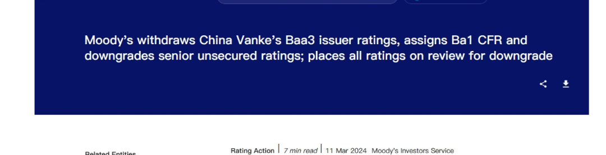
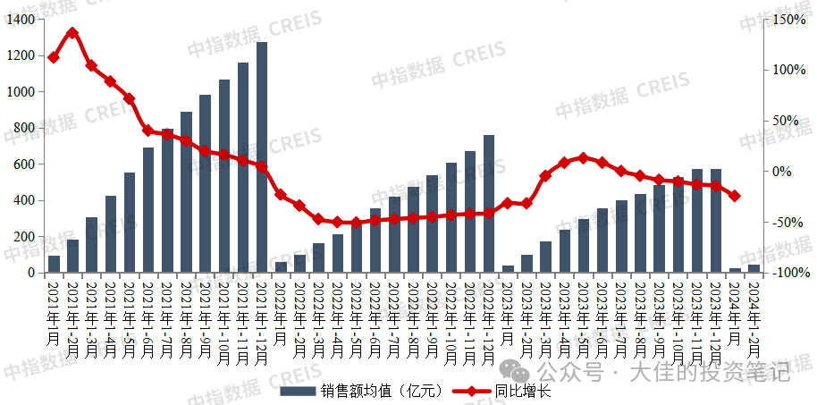

没有中间路线，“万科”和“三十年国债期货”就注定只能活一个。
原创 皑大佳 大佳的投资笔记
2024年03月16日 11:57 广东

本文1400字 丨阅读时长约为3分钟

免责声明：本文是个人日记，不构成投资建议。

文中所有观点， 仅代表个人立场，不具有任何指导作用

所谓的“活”，指的是该投资品种 “不出现极大的风险从而极大地损害到投资本金。”

假如万科跌到碧桂园那种市值，那和“死”在本质上，就没有任何区别。

一、

万科的风险是显而易见的。

即便是深圳地跌，再如何支持万科，都只能给企业提供一定时期的资金。

万科不在于资金短缺。

穆迪将万科的评级，一路下调到垃圾级，并不是因为担心万科的短期偿债能力，而是长期运营能力。

而对于这个运营能力的根本性担忧则在于：

未来房地产市场的销售情况。

如果今年房地产市场情况，继续延续。那么，万科的销售将会回到十年之前。

但销售回到十年之前，那么负债能够回到十年之前吗？

答案是显而易见的不能。万科现在明面上的负债是1.2万亿。看起来比恒大好一些。但负债的结构并不相同。

金融机构对于万科的介入，要比恒大要高的多。尤其是其中很多资金，风险偏好本身就非常小。万科如果债务暴雷，对市场的冲击力度，将会远大于恒大。

因此，有很多资金在押注，万科一定不会暴雷。

二、

三十年国债期货，今年债券市场最火的品种。

相关的etf，今年都有远远超过权益市场的涨幅。

1，从基本面逻辑上来说：

相当部分的资金，对未来前景感到悲观。尤其是房地产是否能够平稳落地的前景。

2，从资金面逻辑上来说：

目前大量的资金淤积在金融机构市场。对于机构来说，无法寻找到确定性比较高的投资品种。最终，只能够投资国债。

3，从交易行为上来说：

当十年期国债已经足够内卷的之后，更多资金进入这个市场，只好大量买入比十年久期更长的三十年国债。同时，为了比较客观的收益，开始疯狂的上杠杆。

那么，三十国债期货的风险主要在于：

1，持续看空未来的利率，造成的一致性。

2，因为一致性造成的内卷，从而不停的增加杠杆。

当然杠杆并不一定会破裂。杠杆是否破裂，取决于方向发生了改变。

那么，押注三十年国债的资金，在下注未来利率一定会继续降低，甚至向日本一样零利率。即一个中国版的失去的三十年。

三、

赌万科一定不会暴雷，实际上的赌的是什么？

赌的是，房地产市场一定会触底反弹，而不会像现在这样，毫无起色的不断下跌。

但房地产的惯性，决定着注定无法靠自身扭转。那么，能让房地产市场软着陆的反法，实际上就只有一个——非常强力的政策。这个政策一定不是单一的，局部的。而是复合式的，全局的政策。

且这个政策，一定非常花钱。

赌三十年国债能够继续上涨的，实际上的赌的是什么？

赌的是，房地产市场继续萧条，整个社会投资回报率进一步下降，从而导致十年期和三十年期国债利率进一步下降。

那么从根本上来说，赌的是不会出现超出日本当年强度的救市政策，从而无可避免的走向零利率。

到了这里，我们就会发现，押注万科不会爆雷的资金，以及押注三十年国债期货继续上涨的资金，对于未来政策的判断完全不同。

四、

从市场的走势来说，三十年国债期货和房地产股的走势总是负相关。

    1，传闻万科获得银团集体救援800亿的当天，万科大涨5%。

当天，三十年国债期货重挫，下跌1.2%。

2，杭州放开二手房限购。浙江本地房企滨江集团大涨，但冲高回落。

当天，三十年国债期货下跌，但低开高走。

从更长时间来说，房地产企业每一次暴雷，其公开债券每一次跳水，三十年国指期货就会的到资金的追捧，获得拉升。

两者资产背后的基本逻辑，以及在公开市场的表现，完美契合。

五、

投资者，需要密切关注自己投资标的背后基本原理。

比如，三十年国债期货，如果发生猛烈的回调，那么你投资的债券产品可能会发生比较大的亏损。

比如，房地产市场进一步走弱，即便万科能够拿到这一笔800亿银团的支持，未来也可能非常非常猛烈的回调。

而无论是债券产品可能发生的亏损，或者是万科的暴雷，都会对现有的市场造成一定的冲击。

单押哪一种情况，都一定会面临相对应的巨大风险。尤其是这两个品种，都具有隐含的杠杆属性。

那么双押就可以吗？

并不。非常有可能是，万科先爆一轮。最终逼迫出史诗级的救市政策，从而再把三十年国债期货在爆破一轮。最终，两头亏钱。

这个概率并不低，且在我们的市场中上演过无数次。

作者：皑（ai）大佳

这篇文章本来应该上周六发表。但因为关于我“因为赞美的不够热烈，而被封号”这件事。的原因，今天才发出来。最近市场的走势，基本验证了我们的逻辑。

感谢大家的阅读，更多的交流，我们评论区见。

如果觉得我的文章，对您有些许的帮助，请您帮点一下右下角“点赞”和“在看”。

皑大佳

26人喜欢
头像头像头像头像头像头像头像头像头像头像头像头像头像头像头像头像头像头像头像头像头像头像头像头像头像头像
个人观点，仅供参考
阅读 10万+

​
写留言
留言 199

王展方
江苏
2024年3月16日
96
如果万科救不起来！
房地产真的就没戏了……

rong添
江苏
2024年3月16日
532
应该是颠倒了，房地产如果还没有起色的话，万科就彻底玩完了

kJ2015
山东
2024年3月16日
18
都是皮包公司，怎么站起来，站起来也是一滩泥，

奕雪霏儿
广东
2024年3月16日
15
为什么要救？钱去哪儿了

隆唐
四川
2024年3月16日
8
姚没入坑应该感谢王石[呲牙]

醉忆尘
四川
2024年3月16日
回复 rong添：直击要害。

清水
江苏
2024年3月16日
回复 rong添：对头

太平洋的小岛
山西
2024年3月16日
5
房事其实望星空那十年埋的雷

刘先军
贵州
2024年3月16日
1
回复 rong添：万科关键是等到下一个周期的来临，等不到就被合并，等到了就重生

王烨
山东
2024年3月17日
4
回复 rong添：鬼儿子鬼所有房地产公司的价值五年十年之内，最高就是零蛋！大概率是负价值！！上帝都救不了的！

忆戈壁酒泉
陕西
2024年3月17日
3
​很清楚了，只要是自家人的事，没有什么是解决不了的。“对严重资不抵债、失去经营能力的房企，要按照法治化、市场化的原则，该破产的破产，该重组的重组。对有损害群众利益行为的，坚决依法查处，让他们付出应有的代价。
​始终坚持房住不炒的定位，完善市场加保障的住房供应体系”。

福禄贵屏厂程13534227928
广东
2024年3月17日
1
回复 rong添：年轻人不结婚，不生孩子，房子的需求也就少了，看看谁扛得住！

耳东
山东
2024年3月17日
2
让没有房子的人进场买房子，这个事情本身就非常难办！

林立祖
广东
2024年3月17日
1
万科现在各方意见最应该倒，品牌溢价最大一个。

儀
广东
2024年3月17日
回复 rong添：起色[撇嘴]好好的企业整成这样子

袁彪
浙江
2024年3月17日
4
回复 rong添：说话的角度不一样：房地产哪怕略好一成都有可能促成万科变好二成，如果万科没有变好说明地产连略好都没有。

不喜欢躺平
上海
2024年3月17日
1
希望万科暴雷，抓一批银行和所有相关人员，所有的医疗，住房，教育，回归到国家，房产的租金，股市的上涨，没年可有一定涨幅。和固定理财差不多。不要大开大合。

一家亲
山西
2024年3月17日
会起来很多，小地产不比大地产大

海阔天空
江苏
2024年3月17日
1
回复 rong添：是的，本末倒置了，房地产大行情不好，何止万科，所有大的开发商都是万科一样的局面

天生我才Mr H
山东
2024年3月17日
2
回复 rong添：是房地产肯定倒！

彭
广东
2024年3月17日
1
这年头还有人想有政策救房地产的？

神经蛙
广东
2024年3月17日
2
什么底气让你觉得房地产会有戏？

Chiang.Z
广东
2024年3月17日
1
你还在幻想

Chris,Hai Yan
北京
2024年3月17日
1
回复 rong添：对。应该是给韭菜发钱买房。 才能救起来

高国俊
山西
2024年3月17日
2
想多了。未来会有房地产，但不代表一定会有万科，万科代表不了房地产，房地产也不在于这一家公司。

阿尔法先生
甘肃
2024年3月17日
1
回复 rong添：潘石屹经历了海南房地产泡沫，神奇的是他能两次都能逃掉！说到底是余量许家印太年轻了

王绍全
浙江
2024年3月17日
你太看重房地产了。中小城市十几年房价没涨甚至下跌的多了去了，那又如何。

启明星
江苏
2024年3月17日
2
万科天天喊要活下去也没有活下去，死了活该。[呲牙][呲牙][呲牙]我看热闹不嫌事大。

Benjamin.Graham
重庆
2024年3月17日
1
现在不是救不救的问题而是救不救得了的问题，即便是万科现在有足够的资金把它存货全部开发出来它又能把这些房子卖给谁？

好好
广东
2024年3月18日
3
老王退休了拿一千多万年薪。你可想郁亮他们工资多少..他们数钱都不知多开心。轮不着你急

乐生qu东环19074256606
河南
2024年3月18日
2
万科早就知道会暴雷，一个都跑不了

风生水起，顺风顺水
山西
2024年3月18日
2
万科在多地延期交房，不给交房，拿着百姓的钱装在了部分人的口袋里，富了自己，苦了百姓的人，就该让他们把钱都掏出来

老子小
上海
2024年3月18日
2
量子态，看各行业都存在非常大的不确定，但从整体概率上看，负面比重大，且有不可逆转的趋势大

魔积德
浙江
2024年3月18日
1
回复 rong添：这是一定的了

春天花开
江苏
2024年3月16日
89
明面上恒大负债2.4万亿，万科负债1.2万亿好一半，皮带哥已经抓起来了万科好一半是不是关起来了……

大佳的投资笔记
作者
2024年3月16日
250
负债的性质不一样 万科的负债 几乎都是不能亏的钱

blind
北京
2024年3月16日
170
万科完全有能力走万达路线，但他选择了恒大路线，那么结局已经很明确了。

张元普
辽宁
2024年3月16日
31
对未来经济预期那么差，为什么铜最近涨那么多？

大佳的投资笔记
作者
2024年3月16日
156
因为铜和中国地房地产本身没什么关系 和电力地需求有关系

虚若无
湖北
2024年3月16日
119
铜定价不在国内

琥珀
江苏
2024年3月16日
40
请看多制造业，别看多房地产

kona
上海
2024年3月16日
7
一个短期预期，一个长期预期

张元普
辽宁
2024年3月16日
10
回复 虚若无：中国作为世界第二大经济体 如果经济真正衰退 对铜价没有影响？

大佳的投资笔记
作者
2024年3月16日
25
没有 谢谢 因为电是刚需 对钢铁煤炭都有影响 对铜 金 都没有影响

タキタキ
广东
2024年3月16日
21
黄金都涨成那样了，看不出预期好的样子。

吴天虹
广东
2024年3月16日
3
回复 芡实：但比特币也涨了，就是预期变好。
所以黄金与比特币的狂欢，对未来到底啥预期？

归雁QuQ
黑龙江
2024年3月16日
19
和地产相关要看黑色系期货，双焦，铁矿，以及下游产品，铜主要是工业金属而不是地产属性

么魂
上海
2024年3月17日
4
走的是滞胀的逻辑

A🏠姜金金（新房团购 二手租售）
江苏
2024年3月17日
8
回复 大佳的投资笔记：说浅表一点，全球其实全部是通货膨胀，大宗商品涨价是很正常的，不止铜别的原料应该也在涨，房地产也只有我们在跌，别的主流国家也在涨

燃野
福建
2024年3月17日
4
回复 琥珀：房地产就是最大的制造业。其他都是弟弟。

欢乐马
上海
2024年3月17日
2
中国作为世界经济第二大体，澳洲有因为中国是第二，没给中国铁矿石涨价吗？

老李
山东
2024年3月17日
回复 大佳的投资笔记：大宗商品主要受国际市场影响。

酒卫红
陕西
2024年3月17日
1
根本没有。两场战争在打，还有史诗级的一场酝酿。

shawfun
江西
2024年3月17日
1
回复 芡实：可惜没有买黄金

Tucker
上海
2024年3月17日
2
目前来看，影响有限

地王大厦（惠州华艺兴五金张生）
江西
2024年3月17日
1
铜、黄金等是美元定价，只要美联储不降息，那就是在默认滞涨，滞涨时期以美元定价的东西不得猛涨啊，再者美元计价的大宗涨上去更加有利于美元向外输出，这个阶段铜主要是金融属性

梦十夜
江苏
2024年3月17日
2
回复 琥珀：凭啥看多制造业，先不讨论地产是不是实体行业，有多少制造业跟地产息息相？

城城
广西
2024年3月18日
回复 芡实：黄金越涨，经济越差

打工人
广东
2024年3月18日
1
所有东西都是复合的，如果中国经济不衰退铜可能涨得更多，你不能说没有交易到这个点

果
河北
2024年3月16日
57
我不信有这个政策，至少跌到2035年吧

大佳的投资笔记
作者
2024年3月16日
152
万科最多撑到2025年

万事如意
辽宁
2024年3月16日
31
那对于持有房产的人，应该是等那个大政策来了之后再卖，还是趁着现在把它都变现了

大佳的投资笔记
作者
2024年3月16日
150
我只能这样说：1，那个可能地大政策可能需要很久。现在北京上海，都没有解除限购。2，未来未必是房价继续下跌多少的问题，而是成交继续下降的问题。3，未来对地产冲击更大地可能是抵押贷破裂之后法拍房入市之后造成的冲击。

万事如意
辽宁
2024年3月16日
31
回复 大佳的投资笔记：超级财政政策今年出不来吗。。。万科确实就几年的把戏了。

Gracelife
广东
2024年3月16日
20
现在房产差不多沒有流动性了，还怎么变现，十年前购入价格半价卖么？

零
山东
2024年3月16日
136
人家都润了，留个烂摊子给群主背锅

Layangi
上海
2024年3月16日
91
大佳是我关注的所有财经博主对未来预测最准确 的  对事情的看法深度角度都无人能及 没有之一

大佳的投资笔记
作者
2024年3月16日
25
[害羞]

小陈
广东
2024年3月16日
31
但是别人就非要一边领着高薪，一边红烧肉大快朵颐[鼓掌]

风一样自由
河北
2024年3月16日
15
我给房地产出一个主意，就是成立房产银行，把位置还好，已经基本完工的地产由银行接盘，反正欠了银行巨量的钱，然后交由各地公租房系统不设门槛出租。且可以购买房租抵款。把短期款项以房租形式回收。

其华
广西
2024年3月16日
1
回复 大佳的投资笔记：深度学习

散淡
重庆
2024年3月16日
78
房子太多了！供远远大于求，这应该是房企的死穴吧。

小山丘
浙江
2024年3月16日
48
先来三年股市牛市，再去抄底楼市，十年之后又是一片繁荣景象，有无可能[呲牙]

大佳的投资笔记
作者
2024年3月16日
72
乐观的预期 谨慎的行动

s10gyi
湖南
2024年3月16日
67
给予作者在所有财经评论中最高的评价

大佳的投资笔记
作者
2024年3月16日
14
感谢🥹

Dream
北京
2024年3月16日
33
在房市亏，在股市又亏，大难了[流泪]

大佳的投资笔记
作者
2024年3月16日
60
因为这两个资产本质没有区别

天马行空
江苏
2024年3月16日
25
还能有什么史诗级的救市政策?

大佳的投资笔记
作者
2024年3月16日
55
超级大的财政政策

【正信票研】方明
浙江
2024年3月16日
14
零利率[流泪][流泪][流泪][流泪]

大佳的投资笔记
作者
2024年3月16日
46
说真的 在中国我觉得不可能

狂暴到酷
河南
2024年3月16日
12
回复 大佳的投资笔记：零利率，那股市不得涨上天，大量的资金进入股市

s10gyi
湖南
2024年3月16日
3
回复 大佳的投资笔记：愿虚心请教理由

大佳的投资笔记
作者
2024年3月16日
15
回复 A -：现在立刻零利率 可能会 但最后可能是被动零利率

大佳的投资笔记
作者
2024年3月16日
34
回复 s10gyi：因为零利率是发达国家的特权 中国发展特别不平衡 零利率会引发一系列问题

蔡同学
湖南
2024年3月16日
12
零利率的话，钱都跑出去了，外汇怎么办？

s10gyi
湖南
2024年3月16日
25
回复 大佳的投资笔记：“不平衡”三个字，答复的一针见血。这事，心知肚明即可，不能明说

周而复始是为清
湖北
2024年3月17日
42
和一位朋友讨论过，政策的力度可能要大到给每一个公民都发50-100万才够。注意是每一个人，目前发钱的方式只会导致不平衡的加剧和资产外流。疫情几年相当把“自耕农，小地主”这些良家子的造血能力全部毁灭性打击了，同时旧的房贷又在不停吸血。需要很长时间的恢复，甚至恢复的过程还赶不上封建时代土地兼并的过程。叠加汇率等影响。几乎两难。除非立足国外。一般的地县级市经济大部分靠公务员经济了，这是个螺旋下跌的过程，这点不能展开说的哪种，

大老师讲财经
北京
2024年3月16日
42
两会定调了，没有大政策。赤字率，特别国债都是有限的，没有“大”政策。但降息降准是明牌，肯定押30年国债。真的0利率，也未必就是失去30年，你的前提是，国家就一直这么“躺”。政策可以明年再订，降息也没这么快。国债还是牛市行情。万科的问题是销售，没大招根本救不了，大基金收储？哪来的钱啊

黎生
广东
2024年3月16日
23
[流泪][流泪][流泪][流泪][流泪][流泪][流泪][流泪][流泪][流泪][流泪][流泪][流泪][流泪][流泪][流泪][流泪][流泪][流泪][流泪]

大佳的投资笔记
作者
2024年3月16日
41
这是庆祝我解封吗

西西弗斯
江苏
2024年3月16日
38
庆幸又能看到了，现在总是劣币驱逐良币，太可悲了

大佳的投资笔记
作者
2024年3月16日
12
[拥抱][拥抱][拥抱]

朱超凡
上海
2024年3月16日
37
万科爆了对地产影响远大于恒大，相信智囊层不会到那一步再行动。爆了对股票交易是机会，但经济衰退的锅没人敢背。

Layangi
上海
2024年3月16日
37
最重要的是 不会晦涩难懂 故作高深 [捂脸][破涕为笑]

大佳的投资笔记
作者
2024年3月16日
14
感谢 哈哈哈哈

乐叶 Leye
重庆
2024年3月16日
15
有没有可能大放水量化宽松就房市同时成就了国债？ 傻不拉几啥也不懂瞎扯淡

大佳的投资笔记
作者
2024年3月16日
34
没可能 不可能出现房地产转好 但国债利率继续下降的情况 日本零利率了很多年 都无法阻止楼市继续下跌

特里
广东
2024年3月16日
34
普通人对这两个课题也只能看看而已，因为手上就那三瓜两枣，丢下去连水花都没有。其实若真要救市，在一线城市先试拆一批房龄40-50年的老房，拆完之后不再建住宅，就地建公园或其他公共设施，一批不行就二批直到最后平衡为止。其实过去卖地收入的钱收过了头，如今也应该回吐些出来吧，渠道也可以财政赤字增加些，或者发专项债券，反正办法比困难多，是不是大佳作者？

大佳的投资笔记
作者
2024年3月16日
11
我其实是在讨论两种资产的风险

boxer
山东
2024年3月17日
22
卖的地钱早花了，还能吐出来？你大概不知道，批了不花明年不批的道理。

黄
上海
2024年3月17日
8
拆没问题，.40，50年的房子基本上都是市中心，周边市政配套地铁医院学校都是服务于住在其中的人，人没了，服务谁？二，谁出钱？拆迁的钱，建设的钱，维护的钱，这是只有投入没有产出的！

时光
江苏
2024年3月17日
5
省钱比花钱难多了

J
湖南
2024年3月16日
5
Gov手里要是有钱，还会这么紧张吗？你是一个市的老大也就几年的功夫，你会把money留给下一任吗？肯定疯狂搞业绩好升职啊

郑会淞
广东
2024年3月17日
4
没有可行性，因为拆迁老房子按照市场价补偿，钱不够买新房，如果没有合适名目，很容易引发群体矛盾。

maohe
上海
2024年3月17日
4
我要是老板，也搞这个，超级规模的以旧换新活动。全面拉动地产

夜光燎
天津
2024年3月17日
2
好日子过惯了，经济下行也不要扣扣索索，继续锦衣玉食，没钱就网贷，反正办法总比困难多，是不是楼主？

逍遥和他的小伙伴
浙江
2024年3月17日
3
地方zf这个铁公鸡，还指望拿了钱能吐出来？

陆金成
湖北
2024年3月17日
3
这么多年卖地的钱大多都搞城市基建了，或者发公务员事业单位工资了，从哪里拿钱出来？

吴大夫
湖南
2024年3月17日
1
依法治国，房子不是你想拆就能拆。

H.H.F
江苏
2024年3月16日
20
周五已经清空万科，等待爆破抄底

垚垚领先
江苏
2024年3月16日
34
君子不立危墙之下……为啥偏要去蹚浑水

栗子
辽宁
2024年3月16日
17
既然已经逃离火坑 为啥还要跳进去 出来就别回去

李奇星
河南
2024年3月16日
5
去年趟浑水亏了四万

李奇星
河南
2024年3月16日
32
等史诗级政策出来，买保利[得意]

采支冰棒
福建
2024年3月16日
31
万科不会是雷曼的角色吧？[撇嘴]

土土🇨🇳
福建
2024年3月16日
29
有没有可能两者都要死，万科的问题主要是资产泡沫破灭造成的，并不是说地产没有需求。至于零利率，更是不可能，老龄化背景下未来大概率高通胀。日本经验不可复制，一是日本高峰期人均GDP是美国的2倍，另外当时发展中国家特别是中国劳动力非常的丰富。

星辰大海
福建
2024年3月16日
28
商品房，安置房，人才房，小产权房，自建房，商业住宅，这些房子都是能住人的，那是一个天量的住房面积，再加上现在每年将要竣工的房子，总量是越来越多，而人口却越来越少，每年新盖的房子能撑起多大的交易量？

飞
上海
2024年3月17日
25
房地产未来一定死。理由很简单，我们的薪资比太低，依靠高杠杆的消费注定会走向抛物线顶点。而这个变化不是能靠任何政策所能改变的。

楼顺峰
浙江
2024年3月16日
25
万科的8000亿存货需要打几折才能变现？存货打折后，他的净资产又会是多少呢？

启明星
江苏
2024年3月17日
5
最少打五折[微笑]

king
山东
2024年3月17日
3
肯定要大额计提减值

天边的兔子
河北
2024年3月16日
23
能解封就是不幸中的万幸，啊，每天看你的文章习惯了，突然没有了，很不习惯

胡涂
浙江
2024年3月16日
21
这文章有点深度了，看了三遍，也才明白八九，回头再品品[微笑]

大佳的投资笔记
作者
2024年3月16日
23
写的有点严肃 因为探讨了资产地底层逻辑

阿白
西藏
2024年3月16日
22
那就先拿国债，等万科爆了再卖了国债去买万科[旺柴]

kino
陕西
2024年3月16日
19
开放宅基地买卖+永久产权+不动产税，可以救地产，但必须危机倒逼改革，万科也许是药引

宫伟达
辽宁
2024年3月16日
19
万科vs30国债，就是风险资产和避险资产的代表选项，当然大前提都是世道底线还在。底线不在了，就没区别了

沐辰
河北
2024年3月16日
18
普通人买房了下跌，不买房钱又贬值，太难了

海
江苏
2024年3月17日
15
普通人有钱吗[捂脸]

BenJiang之小😍姜真犟💕哟～
四川
2024年3月17日
5
所以说越来越多人都开始躺平了[撇嘴]

阿有
广东
2024年3月16日
1
奢侈品保值品，名表名袋什么的，，既可装饰又可保值，，你值得拥有！😆

李泽阳
广东
2024年3月16日
18
逻辑严谨，观点明确，通俗易懂，具有建设性和理性，按这个方向坚持下去，你一定会扬名立万，看好你！

大佳的投资笔记
作者
2024年3月16日
8
感谢～

震浩の爹
江苏
2024年3月18日
15
人口问题是个逃不过的坎，然鹅现在的人口问题其实是底层逻辑出现了变故，在十五年前你可以说是三座大山压制了生育欲望，而现在不一样了，比如接机固化，新式门阀，工作岗位也能通过血缘传播了，教育上卷到极致开始躺平，当新一代捧着手机又被捧在手心长大的00后进入婚龄育龄，请问出生率能有0.6甚至是0.5？人口迭代数据差不多1.5，差太远了！房产问题在人口问题前面还真的不那么重要，随着时间的推移，人口问题会越来越让人揪心，不信随便看看留言，就知道年轻人最真实的想法了

花蘑菇
山东
2024年3月18日
14
两会政策已经明确了，地产只救项目，不救企业，地方zf保证债务缓解压力后，报备项目逐级备案。以此平推地产平稳过渡，不救，该暴雷的没有解决方案的拔管。

大隐隐于市
安徽
2024年3月16日
13
可以让保利收购万科啊哈哈😄

michael🐭
上海
2024年3月16日
13
是的 最近铁矿也是这样的走势

东郭先生
广东
2024年3月16日
12
非常同意大佳的判断“单押哪一种情况，都一定会面临相对应的巨大风险。尤其是这两个品种，都具有隐含的杠杆属性”。策略都不押。

龙旋
浙江
2024年3月16日
11
还30年国债，恐怕等不到喔[捂脸]

孔林
浙江
2024年3月17日
10
化债周期大背景下，任何政策事件都不会改变趋势。什么时候化债完成，什么时候地产才能触底。化债还要看改革力度，单纯出政策也没有用了。

郊区农民欢乐多
上海
2024年3月16日
10
没有只有得利没有吃亏的政策。就算加上中国特色也是要讲经济规律。

胃肠李火火
广西
2024年3月16日
10
以现在的结婚生育需求和观念来看，地产需求改善起码再要个3-5年

之
海南
2024年3月16日
10
高人[社会社会]我已经被中外势力这样洗过好几次

天道无情
四川
2024年3月16日
10
我们现在走的路是漂亮国小日子已经经历过的，所以可以借鉴经验，不会出现趴窝的结果，放心大胆的预测，谨慎的观望出手。

不言堂
江苏
2024年3月16日
10
很有道理

Chen_莎吖
湖南
2024年3月16日
10
庆祝你的更新，所以留个言[奸笑]
1条回复

小刀
四川
2024年3月17日
9
买黄金应该是比这二者都好的选择。全球经济问题的核心是高负债。中美欧日都不可持续，在排除大规模战争出清债务的前提下，货币继续贬值，长期低利率将是被迫的选择。否则就要发生债务危机，违约。二者必居其一。无论出现哪一种情况，黄金都受益。

椰岛听风
海南
2024年3月17日
9
主要是村长大人到底知不知道地产死火带来的一系列后果？对此我表示极度悲观

龙俊
四川
2024年3月17日
8
短期看是如此，长期看（3-5年）会不会有其他可能？1.如果地产衰退而万科成为剩者，那么投国债和万科均是赢家。2如果万科出局，地产衰退，经济有新的增长点顶上来，资金成本走高，那么投万科和国债均是输家。

亦心
福建
2024年3月17日
8
万科的负债，境内债640亿 境外债合300-400亿，对他的背景来说，无关紧要，最大的问题是，万科可以救，楼市不好救，万科救了还有下一个园，下一个创 无非穆迪的评级调整问题
这个问题的核心在于，谁来担责，就所谓是等待一个我们认为的史诗级的政策的发布而已，枪弹已经备好了，就等人一声令下了

Shire
上海
2024年3月16日
8
大佳，zf为了刺激经济，现有存款利率会继续下降吗？

大佳的投资笔记
作者
2024年3月16日
8
会

super model style 1
湖南
2024年3月16日
8
中肯而不晦涩，直白而不玄虚，简约而不简单，放松但不放纵[强]

GHY
山东
2024年3月16日
8
天天看大佳的分折佳作，几天没看，总感觉缺了点什么。

科学养猫的狂人
陕西
2024年3月17日
7
我买了万科股票，买了业绩基准是30年期的债基[流泪]

刘忠
广东
2024年3月17日
7
没用了，现在没结婚的不想结婚，已经结婚的都开始离婚，房子再也不是必需品了

zhong
广东
2024年3月16日
7
好文

玛雅啦啦
江苏
2024年3月16日
7
我靠，好有道理

大佳的投资笔记
作者
2024年3月16日
5
[旺柴]

神经蛙
浙江
2024年3月16日
7
感谢大佳的分享！终于可以看到大佳文章了[庆祝]

酷酷
上海
2024年3月16日
7
就是想点个赞 因为终于看到发文章了[呲牙]

王绍全
日本
2024年3月17日
6
核心论据是“房地产的惯性，决定着注定无法靠自身扭转”，我对这一点持保留态度。世界历史上，房价起起跌跌太多了。日本经历那失去的三十年，不仅仅是房价的问题，甚至房价都只是个结果，而不是原因。

张静
上海
2024年3月17日
6
感觉作者是说，新时代和万科，结果只能二选一

宁连成
山东
2024年3月16日
6
好文章，只能说势不可挡。

Murcury
四川
2024年3月16日
6
几日不见，有点想念![呲牙]

遇见
河南
2024年3月16日
6
是啊发

赵钢镚
北京
2024年3月17日
5
个人觉得万科也不是什么最后的稻草，当年买恒大信托的时候，绝大部分人都觉得恒大大而不能倒。我买的恒大信托到期的比较早，躲过了一劫。如果要说什么不能出事的话，国债肯定排第一。我感觉万科也不会走恒大的老路。起码北京上海的房子还有搞头。现在北京的问题就是没有好房子。卖的不是偏远山区就是犄角旮旯

杨鹏-TDKG
北京
2024年3月17日
5
现在的调控难度远大于十年前，市场总体需求基本饱和，只能腾挪式发展，大城市如果放开限购，只是将购买力从乡镇搬到了大城市，大城市即便稳住了，三四线必然更完蛋，看看这些房地产企业的存货分布吧，不见得是好事。

家煦
江苏
2024年3月17日
5
您的基本判断是：救市是可以救的，只要愿意！是吗？这个判断是错误的，市场怎么可能是通过救与不救发展的？这个逻辑不成立吧！

浦宇平
上海
2024年3月16日
5
非常好的视角！

丁辉
四川
2024年3月16日
5
你先出，你押大我就押小

蓝昊
山东
2024年3月16日
5
出来了

赵钢镚
北京
2024年3月17日
4
一个最最基本的道理，现在有不少人手里有钱，但是不敢买房 不敢买股票 大多数存在银行里或者买信托。现在就是在找一个收益投资的平衡点。我不是专业人士，用词不专业。就是我有1000万，现在买标品信托，4%的收益，那么我就会找收益差不多的投资，商铺 写字楼 甚至住宅 黄金，这些钱大部分要寻找出路，所以不用太担心房地产，等其他收益不够的时候，钱自然就会去买房，买股票，保守一点去买国债。市面上有上百万亿

Pang
广东
2024年3月17日
4
现在是需求端被杀戮式的打压后再也无法回光返照，史诗级救市其实就三招解决：1、取消三道红线；2、短期内不会研究考虑房产税；2、70年产权改为永久产权。

忆戈壁酒泉
陕西
2024年3月17日
4
​很清楚了，只要是自家人的事，没有什么是解决不了的。“对严重资不抵债、失去经营能力的房企，要按照法治化、市场化的原则，该破产的破产，该重组的重组。对有损害群众利益行为的，坚决依法查处，让他们付出应有的代价。
​始终坚持房住不炒的定位，完善市场加保障的住房供应体系”。

海洋
澳大利亚
2024年3月17日
4
大不了人民币贬值十倍，工资一个月10万起，一碗面一千，房贷就被稀释到忽略不计，那个时候房价肯定起飞一波，怎么不得100万一平米[Smile]出口还能大涨。就像韩国一样嘛[Grin]

YUE平
广东
2024年3月17日
4
关于房地产，zf还有一个免费的大招憋着，记得几年前各地登记宅基地确权吗，超出规定人均面积的占了绝大多数，到时一句按法律收回……

天行客
江苏
2024年3月16日
4
咱们的国情负利率想都不要想，到自然常数e还是有可能的

郡曼 瑀熙
浙江
2024年3月16日
4
期待了这么久的文章终于出来了，昨天晚上睡前还看了你有没有发上来，胡思乱想了一下，好在可以继续有寄托了！

李欣洋
山西
2024年3月18日
3
一波农村集体资产货币化续命30年

土国Tucker
中国香港
2024年3月17日
3
有政策，新一輪棚改舊改在路上，去舊救新。沒有人能做空自己的國家發財。

郭智刚
广东
2024年3月17日
3
做多国债，做空万科。现在跟30年前的日本差不多。

VV
辽宁
2024年3月16日
3
也许   聪明的钱在做对冲套利

Jason
上海
2024年3月17日
2
降利率也可以刺激房地产吧？

haugust
上海
2024年3月17日
2
稳一稳压一压降风险，
找准时机搞统一，
那才是最大的不可控风险。

LN
加拿大
2024年3月17日
好文章，独特的视角。如果未来利率下降，对房地产是利好吗？

大佳的投资笔记
作者
2024年3月17日
2
银行贷款利率下降是利好 但国债不是

陈南霖
海南
2024年3月17日
2
保交楼还是保主体？他的存货在几线？搞清楚了后必然是做多30年

老周
北京
2024年3月17日
2
这个逻辑牛逼呀，但是房地产大概率要完了，万科还有救吗

专门烧酒的老李头
辽宁
2024年3月17日
2
看了作者的文章，有种拨云见日的感觉，受教了[抱拳][抱拳]

xc
江苏
2024年3月17日
2
那您个人认为持有哪个好呢，谢谢

大佳的投资笔记
作者
2024年3月17日
2
我觉得风险都很大

李泽阳
广东
2024年3月16日
2
这篇文章有质的突破。

于逸宸
陕西
2024年3月17日
1
一点拙见。并非二选一，中间经过一系列干预后，最终30国债斜率放缓并与10国债价差回归合理区间后，长期资金溢出进股市，地产触底并反弹。至于中间会有啥操作，猜不出。[偷笑]

旧梦解殇。
浙江
2024年3月17日
1
金融战的最后阶段，做空势力就是干中国楼市，上面的主要目标就不是股市而是楼市场了

金秋
上海
2024年3月17日
1
开动印钞机呢？实际上已经开了！我赌万科不会爆。买了万科的股票，小赌怡神。
已无更多数据

写留言
留言 199

王展方
江苏
2024年3月16日
96
如果万科救不起来！
房地产真的就没戏了……

rong添
江苏
2024年3月16日
532
应该是颠倒了，房地产如果还没有起色的话，万科就彻底玩完了

kJ2015
山东
2024年3月16日
18
都是皮包公司，怎么站起来，站起来也是一滩泥，

奕雪霏儿
广东
2024年3月16日
15
为什么要救？钱去哪儿了

隆唐
四川
2024年3月16日
8
姚没入坑应该感谢王石[呲牙]

醉忆尘
四川
2024年3月16日
回复 rong添：直击要害。

清水
江苏
2024年3月16日
回复 rong添：对头

太平洋的小岛
山西
2024年3月16日
5
房事其实望星空那十年埋的雷

刘先军
贵州
2024年3月16日
1
回复 rong添：万科关键是等到下一个周期的来临，等不到就被合并，等到了就重生

王烨
山东
2024年3月17日
4
回复 rong添：鬼儿子鬼所有房地产公司的价值五年十年之内，最高就是零蛋！大概率是负价值！！上帝都救不了的！

忆戈壁酒泉
陕西
2024年3月17日
3
​很清楚了，只要是自家人的事，没有什么是解决不了的。“对严重资不抵债、失去经营能力的房企，要按照法治化、市场化的原则，该破产的破产，该重组的重组。对有损害群众利益行为的，坚决依法查处，让他们付出应有的代价。
​始终坚持房住不炒的定位，完善市场加保障的住房供应体系”。

福禄贵屏厂程13534227928
广东
2024年3月17日
1
回复 rong添：年轻人不结婚，不生孩子，房子的需求也就少了，看看谁扛得住！

耳东
山东
2024年3月17日
2
让没有房子的人进场买房子，这个事情本身就非常难办！

林立祖
广东
2024年3月17日
1
万科现在各方意见最应该倒，品牌溢价最大一个。

儀
广东
2024年3月17日
回复 rong添：起色[撇嘴]好好的企业整成这样子

袁彪
浙江
2024年3月17日
4
回复 rong添：说话的角度不一样：房地产哪怕略好一成都有可能促成万科变好二成，如果万科没有变好说明地产连略好都没有。

不喜欢躺平
上海
2024年3月17日
1
希望万科暴雷，抓一批银行和所有相关人员，所有的医疗，住房，教育，回归到国家，房产的租金，股市的上涨，没年可有一定涨幅。和固定理财差不多。不要大开大合。

一家亲
山西
2024年3月17日
会起来很多，小地产不比大地产大

海阔天空
江苏
2024年3月17日
1
回复 rong添：是的，本末倒置了，房地产大行情不好，何止万科，所有大的开发商都是万科一样的局面

天生我才Mr H
山东
2024年3月17日
2
回复 rong添：是房地产肯定倒！

彭
广东
2024年3月17日
1
这年头还有人想有政策救房地产的？

神经蛙
广东
2024年3月17日
2
什么底气让你觉得房地产会有戏？

Chiang.Z
广东
2024年3月17日
1
你还在幻想

Chris,Hai Yan
北京
2024年3月17日
1
回复 rong添：对。应该是给韭菜发钱买房。 才能救起来

高国俊
山西
2024年3月17日
2
想多了。未来会有房地产，但不代表一定会有万科，万科代表不了房地产，房地产也不在于这一家公司。

阿尔法先生
甘肃
2024年3月17日
1
回复 rong添：潘石屹经历了海南房地产泡沫，神奇的是他能两次都能逃掉！说到底是余量许家印太年轻了

王绍全
浙江
2024年3月17日
你太看重房地产了。中小城市十几年房价没涨甚至下跌的多了去了，那又如何。

启明星
江苏
2024年3月17日
2
万科天天喊要活下去也没有活下去，死了活该。[呲牙][呲牙][呲牙]我看热闹不嫌事大。

Benjamin.Graham
重庆
2024年3月17日
1
现在不是救不救的问题而是救不救得了的问题，即便是万科现在有足够的资金把它存货全部开发出来它又能把这些房子卖给谁？

好好
广东
2024年3月18日
3
老王退休了拿一千多万年薪。你可想郁亮他们工资多少..他们数钱都不知多开心。轮不着你急

乐生qu东环19074256606
河南
2024年3月18日
2
万科早就知道会暴雷，一个都跑不了

风生水起，顺风顺水
山西
2024年3月18日
2
万科在多地延期交房，不给交房，拿着百姓的钱装在了部分人的口袋里，富了自己，苦了百姓的人，就该让他们把钱都掏出来

老子小
上海
2024年3月18日
2
量子态，看各行业都存在非常大的不确定，但从整体概率上看，负面比重大，且有不可逆转的趋势大

魔积德
浙江
2024年3月18日
1
回复 rong添：这是一定的了

春天花开
江苏
2024年3月16日
89
明面上恒大负债2.4万亿，万科负债1.2万亿好一半，皮带哥已经抓起来了万科好一半是不是关起来了……

大佳的投资笔记
作者
2024年3月16日
250
负债的性质不一样 万科的负债 几乎都是不能亏的钱

blind
北京
2024年3月16日
170
万科完全有能力走万达路线，但他选择了恒大路线，那么结局已经很明确了。

张元普
辽宁
2024年3月16日
31
对未来经济预期那么差，为什么铜最近涨那么多？

大佳的投资笔记
作者
2024年3月16日
156
因为铜和中国地房地产本身没什么关系 和电力地需求有关系

虚若无
湖北
2024年3月16日
119
铜定价不在国内

琥珀
江苏
2024年3月16日
40
请看多制造业，别看多房地产

kona
上海
2024年3月16日
7
一个短期预期，一个长期预期

张元普
辽宁
2024年3月16日
10
回复 虚若无：中国作为世界第二大经济体 如果经济真正衰退 对铜价没有影响？

大佳的投资笔记
作者
2024年3月16日
25
没有 谢谢 因为电是刚需 对钢铁煤炭都有影响 对铜 金 都没有影响

タキタキ
广东
2024年3月16日
21
黄金都涨成那样了，看不出预期好的样子。

吴天虹
广东
2024年3月16日
3
回复 芡实：但比特币也涨了，就是预期变好。
所以黄金与比特币的狂欢，对未来到底啥预期？

归雁QuQ
黑龙江
2024年3月16日
19
和地产相关要看黑色系期货，双焦，铁矿，以及下游产品，铜主要是工业金属而不是地产属性

么魂
上海
2024年3月17日
4
走的是滞胀的逻辑

A🏠姜金金（新房团购 二手租售）
江苏
2024年3月17日
8
回复 大佳的投资笔记：说浅表一点，全球其实全部是通货膨胀，大宗商品涨价是很正常的，不止铜别的原料应该也在涨，房地产也只有我们在跌，别的主流国家也在涨

燃野
福建
2024年3月17日
4
回复 琥珀：房地产就是最大的制造业。其他都是弟弟。

欢乐马
上海
2024年3月17日
2
中国作为世界经济第二大体，澳洲有因为中国是第二，没给中国铁矿石涨价吗？

老李
山东
2024年3月17日
回复 大佳的投资笔记：大宗商品主要受国际市场影响。

酒卫红
陕西
2024年3月17日
1
根本没有。两场战争在打，还有史诗级的一场酝酿。

shawfun
江西
2024年3月17日
1
回复 芡实：可惜没有买黄金

Tucker
上海
2024年3月17日
2
目前来看，影响有限

地王大厦（惠州华艺兴五金张生）
江西
2024年3月17日
1
铜、黄金等是美元定价，只要美联储不降息，那就是在默认滞涨，滞涨时期以美元定价的东西不得猛涨啊，再者美元计价的大宗涨上去更加有利于美元向外输出，这个阶段铜主要是金融属性

梦十夜
江苏
2024年3月17日
2
回复 琥珀：凭啥看多制造业，先不讨论地产是不是实体行业，有多少制造业跟地产息息相？

城城
广西
2024年3月18日
回复 芡实：黄金越涨，经济越差

打工人
广东
2024年3月18日
1
所有东西都是复合的，如果中国经济不衰退铜可能涨得更多，你不能说没有交易到这个点

果
河北
2024年3月16日
57
我不信有这个政策，至少跌到2035年吧

大佳的投资笔记
作者
2024年3月16日
152
万科最多撑到2025年

万事如意
辽宁
2024年3月16日
31
那对于持有房产的人，应该是等那个大政策来了之后再卖，还是趁着现在把它都变现了

大佳的投资笔记
作者
2024年3月16日
150
我只能这样说：1，那个可能地大政策可能需要很久。现在北京上海，都没有解除限购。2，未来未必是房价继续下跌多少的问题，而是成交继续下降的问题。3，未来对地产冲击更大地可能是抵押贷破裂之后法拍房入市之后造成的冲击。

万事如意
辽宁
2024年3月16日
31
回复 大佳的投资笔记：超级财政政策今年出不来吗。。。万科确实就几年的把戏了。

Gracelife
广东
2024年3月16日
20
现在房产差不多沒有流动性了，还怎么变现，十年前购入价格半价卖么？

零
山东
2024年3月16日
136
人家都润了，留个烂摊子给群主背锅

Layangi
上海
2024年3月16日
91
大佳是我关注的所有财经博主对未来预测最准确 的  对事情的看法深度角度都无人能及 没有之一

大佳的投资笔记
作者
2024年3月16日
25
[害羞]

小陈
广东
2024年3月16日
31
但是别人就非要一边领着高薪，一边红烧肉大快朵颐[鼓掌]

风一样自由
河北
2024年3月16日
15
我给房地产出一个主意，就是成立房产银行，把位置还好，已经基本完工的地产由银行接盘，反正欠了银行巨量的钱，然后交由各地公租房系统不设门槛出租。且可以购买房租抵款。把短期款项以房租形式回收。

其华
广西
2024年3月16日
1
回复 大佳的投资笔记：深度学习

散淡
重庆
2024年3月16日
78
房子太多了！供远远大于求，这应该是房企的死穴吧。

小山丘
浙江
2024年3月16日
48
先来三年股市牛市，再去抄底楼市，十年之后又是一片繁荣景象，有无可能[呲牙]

大佳的投资笔记
作者
2024年3月16日
72
乐观的预期 谨慎的行动

s10gyi
湖南
2024年3月16日
67
给予作者在所有财经评论中最高的评价

大佳的投资笔记
作者
2024年3月16日
14
感谢🥹

Dream
北京
2024年3月16日
33
在房市亏，在股市又亏，大难了[流泪]

大佳的投资笔记
作者
2024年3月16日
60
因为这两个资产本质没有区别

天马行空
江苏
2024年3月16日
25
还能有什么史诗级的救市政策?

大佳的投资笔记
作者
2024年3月16日
55
超级大的财政政策

【正信票研】方明
浙江
2024年3月16日
14
零利率[流泪][流泪][流泪][流泪]

大佳的投资笔记
作者
2024年3月16日
46
说真的 在中国我觉得不可能

狂暴到酷
河南
2024年3月16日
12
回复 大佳的投资笔记：零利率，那股市不得涨上天，大量的资金进入股市

s10gyi
湖南
2024年3月16日
3
回复 大佳的投资笔记：愿虚心请教理由

大佳的投资笔记
作者
2024年3月16日
15
回复 A -：现在立刻零利率 可能会 但最后可能是被动零利率

大佳的投资笔记
作者
2024年3月16日
34
回复 s10gyi：因为零利率是发达国家的特权 中国发展特别不平衡 零利率会引发一系列问题

蔡同学
湖南
2024年3月16日
12
零利率的话，钱都跑出去了，外汇怎么办？

s10gyi
湖南
2024年3月16日
25
回复 大佳的投资笔记：“不平衡”三个字，答复的一针见血。这事，心知肚明即可，不能明说

周而复始是为清
湖北
2024年3月17日
42
和一位朋友讨论过，政策的力度可能要大到给每一个公民都发50-100万才够。注意是每一个人，目前发钱的方式只会导致不平衡的加剧和资产外流。疫情几年相当把“自耕农，小地主”这些良家子的造血能力全部毁灭性打击了，同时旧的房贷又在不停吸血。需要很长时间的恢复，甚至恢复的过程还赶不上封建时代土地兼并的过程。叠加汇率等影响。几乎两难。除非立足国外。一般的地县级市经济大部分靠公务员经济了，这是个螺旋下跌的过程，这点不能展开说的哪种，

大老师讲财经
北京
2024年3月16日
42
两会定调了，没有大政策。赤字率，特别国债都是有限的，没有“大”政策。但降息降准是明牌，肯定押30年国债。真的0利率，也未必就是失去30年，你的前提是，国家就一直这么“躺”。政策可以明年再订，降息也没这么快。国债还是牛市行情。万科的问题是销售，没大招根本救不了，大基金收储？哪来的钱啊

黎生
广东
2024年3月16日
23
[流泪][流泪][流泪][流泪][流泪][流泪][流泪][流泪][流泪][流泪][流泪][流泪][流泪][流泪][流泪][流泪][流泪][流泪][流泪][流泪]

大佳的投资笔记
作者
2024年3月16日
41
这是庆祝我解封吗

西西弗斯
江苏
2024年3月16日
38
庆幸又能看到了，现在总是劣币驱逐良币，太可悲了

大佳的投资笔记
作者
2024年3月16日
12
[拥抱][拥抱][拥抱]

朱超凡
上海
2024年3月16日
37
万科爆了对地产影响远大于恒大，相信智囊层不会到那一步再行动。爆了对股票交易是机会，但经济衰退的锅没人敢背。

Layangi
上海
2024年3月16日
37
最重要的是 不会晦涩难懂 故作高深 [捂脸][破涕为笑]

大佳的投资笔记
作者
2024年3月16日
14
感谢 哈哈哈哈

乐叶 Leye
重庆
2024年3月16日
15
有没有可能大放水量化宽松就房市同时成就了国债？ 傻不拉几啥也不懂瞎扯淡

大佳的投资笔记
作者
2024年3月16日
34
没可能 不可能出现房地产转好 但国债利率继续下降的情况 日本零利率了很多年 都无法阻止楼市继续下跌

特里
广东
2024年3月16日
34
普通人对这两个课题也只能看看而已，因为手上就那三瓜两枣，丢下去连水花都没有。其实若真要救市，在一线城市先试拆一批房龄40-50年的老房，拆完之后不再建住宅，就地建公园或其他公共设施，一批不行就二批直到最后平衡为止。其实过去卖地收入的钱收过了头，如今也应该回吐些出来吧，渠道也可以财政赤字增加些，或者发专项债券，反正办法比困难多，是不是大佳作者？

大佳的投资笔记
作者
2024年3月16日
11
我其实是在讨论两种资产的风险

boxer
山东
2024年3月17日
22
卖的地钱早花了，还能吐出来？你大概不知道，批了不花明年不批的道理。

黄
上海
2024年3月17日
8
拆没问题，.40，50年的房子基本上都是市中心，周边市政配套地铁医院学校都是服务于住在其中的人，人没了，服务谁？二，谁出钱？拆迁的钱，建设的钱，维护的钱，这是只有投入没有产出的！

时光
江苏
2024年3月17日
5
省钱比花钱难多了

J
湖南
2024年3月16日
5
Gov手里要是有钱，还会这么紧张吗？你是一个市的老大也就几年的功夫，你会把money留给下一任吗？肯定疯狂搞业绩好升职啊

郑会淞
广东
2024年3月17日
4
没有可行性，因为拆迁老房子按照市场价补偿，钱不够买新房，如果没有合适名目，很容易引发群体矛盾。

maohe
上海
2024年3月17日
4
我要是老板，也搞这个，超级规模的以旧换新活动。全面拉动地产

夜光燎
天津
2024年3月17日
2
好日子过惯了，经济下行也不要扣扣索索，继续锦衣玉食，没钱就网贷，反正办法总比困难多，是不是楼主？

逍遥和他的小伙伴
浙江
2024年3月17日
3
地方zf这个铁公鸡，还指望拿了钱能吐出来？

陆金成
湖北
2024年3月17日
3
这么多年卖地的钱大多都搞城市基建了，或者发公务员事业单位工资了，从哪里拿钱出来？

吴大夫
湖南
2024年3月17日
1
依法治国，房子不是你想拆就能拆。

H.H.F
江苏
2024年3月16日
20
周五已经清空万科，等待爆破抄底

垚垚领先
江苏
2024年3月16日
34
君子不立危墙之下……为啥偏要去蹚浑水

栗子
辽宁
2024年3月16日
17
既然已经逃离火坑 为啥还要跳进去 出来就别回去

李奇星
河南
2024年3月16日
5
去年趟浑水亏了四万

李奇星
河南
2024年3月16日
32
等史诗级政策出来，买保利[得意]

采支冰棒
福建
2024年3月16日
31
万科不会是雷曼的角色吧？[撇嘴]

土土🇨🇳
福建
2024年3月16日
29
有没有可能两者都要死，万科的问题主要是资产泡沫破灭造成的，并不是说地产没有需求。至于零利率，更是不可能，老龄化背景下未来大概率高通胀。日本经验不可复制，一是日本高峰期人均GDP是美国的2倍，另外当时发展中国家特别是中国劳动力非常的丰富。

星辰大海
福建
2024年3月16日
28
商品房，安置房，人才房，小产权房，自建房，商业住宅，这些房子都是能住人的，那是一个天量的住房面积，再加上现在每年将要竣工的房子，总量是越来越多，而人口却越来越少，每年新盖的房子能撑起多大的交易量？

飞
上海
2024年3月17日
25
房地产未来一定死。理由很简单，我们的薪资比太低，依靠高杠杆的消费注定会走向抛物线顶点。而这个变化不是能靠任何政策所能改变的。

楼顺峰
浙江
2024年3月16日
25
万科的8000亿存货需要打几折才能变现？存货打折后，他的净资产又会是多少呢？

启明星
江苏
2024年3月17日
5
最少打五折[微笑]

king
山东
2024年3月17日
3
肯定要大额计提减值

天边的兔子
河北
2024年3月16日
23
能解封就是不幸中的万幸，啊，每天看你的文章习惯了，突然没有了，很不习惯

胡涂
浙江
2024年3月16日
21
这文章有点深度了，看了三遍，也才明白八九，回头再品品[微笑]

大佳的投资笔记
作者
2024年3月16日
23
写的有点严肃 因为探讨了资产地底层逻辑

阿白
西藏
2024年3月16日
22
那就先拿国债，等万科爆了再卖了国债去买万科[旺柴]

kino
陕西
2024年3月16日
19
开放宅基地买卖+永久产权+不动产税，可以救地产，但必须危机倒逼改革，万科也许是药引

宫伟达
辽宁
2024年3月16日
19
万科vs30国债，就是风险资产和避险资产的代表选项，当然大前提都是世道底线还在。底线不在了，就没区别了

沐辰
河北
2024年3月16日
18
普通人买房了下跌，不买房钱又贬值，太难了

海
江苏
2024年3月17日
15
普通人有钱吗[捂脸]

BenJiang之小😍姜真犟💕哟～
四川
2024年3月17日
5
所以说越来越多人都开始躺平了[撇嘴]

阿有
广东
2024年3月16日
1
奢侈品保值品，名表名袋什么的，，既可装饰又可保值，，你值得拥有！😆

李泽阳
广东
2024年3月16日
18
逻辑严谨，观点明确，通俗易懂，具有建设性和理性，按这个方向坚持下去，你一定会扬名立万，看好你！

大佳的投资笔记
作者
2024年3月16日
8
感谢～

震浩の爹
江苏
2024年3月18日
15
人口问题是个逃不过的坎，然鹅现在的人口问题其实是底层逻辑出现了变故，在十五年前你可以说是三座大山压制了生育欲望，而现在不一样了，比如接机固化，新式门阀，工作岗位也能通过血缘传播了，教育上卷到极致开始躺平，当新一代捧着手机又被捧在手心长大的00后进入婚龄育龄，请问出生率能有0.6甚至是0.5？人口迭代数据差不多1.5，差太远了！房产问题在人口问题前面还真的不那么重要，随着时间的推移，人口问题会越来越让人揪心，不信随便看看留言，就知道年轻人最真实的想法了

花蘑菇
山东
2024年3月18日
14
两会政策已经明确了，地产只救项目，不救企业，地方zf保证债务缓解压力后，报备项目逐级备案。以此平推地产平稳过渡，不救，该暴雷的没有解决方案的拔管。

大隐隐于市
安徽
2024年3月16日
13
可以让保利收购万科啊哈哈😄

michael🐭
上海
2024年3月16日
13
是的 最近铁矿也是这样的走势

东郭先生
广东
2024年3月16日
12
非常同意大佳的判断“单押哪一种情况，都一定会面临相对应的巨大风险。尤其是这两个品种，都具有隐含的杠杆属性”。策略都不押。

龙旋
浙江
2024年3月16日
11
还30年国债，恐怕等不到喔[捂脸]

孔林
浙江
2024年3月17日
10
化债周期大背景下，任何政策事件都不会改变趋势。什么时候化债完成，什么时候地产才能触底。化债还要看改革力度，单纯出政策也没有用了。

郊区农民欢乐多
上海
2024年3月16日
10
没有只有得利没有吃亏的政策。就算加上中国特色也是要讲经济规律。

胃肠李火火
广西
2024年3月16日
10
以现在的结婚生育需求和观念来看，地产需求改善起码再要个3-5年

之
海南
2024年3月16日
10
高人[社会社会]我已经被中外势力这样洗过好几次

天道无情
四川
2024年3月16日
10
我们现在走的路是漂亮国小日子已经经历过的，所以可以借鉴经验，不会出现趴窝的结果，放心大胆的预测，谨慎的观望出手。

不言堂
江苏
2024年3月16日
10
很有道理

Chen_莎吖
湖南
2024年3月16日
10
庆祝你的更新，所以留个言[奸笑]
1条回复

小刀
四川
2024年3月17日
9
买黄金应该是比这二者都好的选择。全球经济问题的核心是高负债。中美欧日都不可持续，在排除大规模战争出清债务的前提下，货币继续贬值，长期低利率将是被迫的选择。否则就要发生债务危机，违约。二者必居其一。无论出现哪一种情况，黄金都受益。

椰岛听风
海南
2024年3月17日
9
主要是村长大人到底知不知道地产死火带来的一系列后果？对此我表示极度悲观

龙俊
四川
2024年3月17日
8
短期看是如此，长期看（3-5年）会不会有其他可能？1.如果地产衰退而万科成为剩者，那么投国债和万科均是赢家。2如果万科出局，地产衰退，经济有新的增长点顶上来，资金成本走高，那么投万科和国债均是输家。

亦心
福建
2024年3月17日
8
万科的负债，境内债640亿 境外债合300-400亿，对他的背景来说，无关紧要，最大的问题是，万科可以救，楼市不好救，万科救了还有下一个园，下一个创 无非穆迪的评级调整问题
这个问题的核心在于，谁来担责，就所谓是等待一个我们认为的史诗级的政策的发布而已，枪弹已经备好了，就等人一声令下了

Shire
上海
2024年3月16日
8
大佳，zf为了刺激经济，现有存款利率会继续下降吗？

大佳的投资笔记
作者
2024年3月16日
8
会

super model style 1
湖南
2024年3月16日
8
中肯而不晦涩，直白而不玄虚，简约而不简单，放松但不放纵[强]

GHY
山东
2024年3月16日
8
天天看大佳的分折佳作，几天没看，总感觉缺了点什么。

科学养猫的狂人
陕西
2024年3月17日
7
我买了万科股票，买了业绩基准是30年期的债基[流泪]

刘忠
广东
2024年3月17日
7
没用了，现在没结婚的不想结婚，已经结婚的都开始离婚，房子再也不是必需品了

zhong
广东
2024年3月16日
7
好文

玛雅啦啦
江苏
2024年3月16日
7
我靠，好有道理

大佳的投资笔记
作者
2024年3月16日
5
[旺柴]

神经蛙
浙江
2024年3月16日
7
感谢大佳的分享！终于可以看到大佳文章了[庆祝]

酷酷
上海
2024年3月16日
7
就是想点个赞 因为终于看到发文章了[呲牙]

王绍全
日本
2024年3月17日
6
核心论据是“房地产的惯性，决定着注定无法靠自身扭转”，我对这一点持保留态度。世界历史上，房价起起跌跌太多了。日本经历那失去的三十年，不仅仅是房价的问题，甚至房价都只是个结果，而不是原因。

张静
上海
2024年3月17日
6
感觉作者是说，新时代和万科，结果只能二选一

宁连成
山东
2024年3月16日
6
好文章，只能说势不可挡。

Murcury
四川
2024年3月16日
6
几日不见，有点想念![呲牙]

遇见
河南
2024年3月16日
6
是啊发

赵钢镚
北京
2024年3月17日
5
个人觉得万科也不是什么最后的稻草，当年买恒大信托的时候，绝大部分人都觉得恒大大而不能倒。我买的恒大信托到期的比较早，躲过了一劫。如果要说什么不能出事的话，国债肯定排第一。我感觉万科也不会走恒大的老路。起码北京上海的房子还有搞头。现在北京的问题就是没有好房子。卖的不是偏远山区就是犄角旮旯

杨鹏-TDKG
北京
2024年3月17日
5
现在的调控难度远大于十年前，市场总体需求基本饱和，只能腾挪式发展，大城市如果放开限购，只是将购买力从乡镇搬到了大城市，大城市即便稳住了，三四线必然更完蛋，看看这些房地产企业的存货分布吧，不见得是好事。

家煦
江苏
2024年3月17日
5
您的基本判断是：救市是可以救的，只要愿意！是吗？这个判断是错误的，市场怎么可能是通过救与不救发展的？这个逻辑不成立吧！

浦宇平
上海
2024年3月16日
5
非常好的视角！

丁辉
四川
2024年3月16日
5
你先出，你押大我就押小

蓝昊
山东
2024年3月16日
5
出来了

赵钢镚
北京
2024年3月17日
4
一个最最基本的道理，现在有不少人手里有钱，但是不敢买房 不敢买股票 大多数存在银行里或者买信托。现在就是在找一个收益投资的平衡点。我不是专业人士，用词不专业。就是我有1000万，现在买标品信托，4%的收益，那么我就会找收益差不多的投资，商铺 写字楼 甚至住宅 黄金，这些钱大部分要寻找出路，所以不用太担心房地产，等其他收益不够的时候，钱自然就会去买房，买股票，保守一点去买国债。市面上有上百万亿

Pang
广东
2024年3月17日
4
现在是需求端被杀戮式的打压后再也无法回光返照，史诗级救市其实就三招解决：1、取消三道红线；2、短期内不会研究考虑房产税；2、70年产权改为永久产权。

忆戈壁酒泉
陕西
2024年3月17日
4
​很清楚了，只要是自家人的事，没有什么是解决不了的。“对严重资不抵债、失去经营能力的房企，要按照法治化、市场化的原则，该破产的破产，该重组的重组。对有损害群众利益行为的，坚决依法查处，让他们付出应有的代价。
​始终坚持房住不炒的定位，完善市场加保障的住房供应体系”。

海洋
澳大利亚
2024年3月17日
4
大不了人民币贬值十倍，工资一个月10万起，一碗面一千，房贷就被稀释到忽略不计，那个时候房价肯定起飞一波，怎么不得100万一平米[Smile]出口还能大涨。就像韩国一样嘛[Grin]

YUE平
广东
2024年3月17日
4
关于房地产，zf还有一个免费的大招憋着，记得几年前各地登记宅基地确权吗，超出规定人均面积的占了绝大多数，到时一句按法律收回……

天行客
江苏
2024年3月16日
4
咱们的国情负利率想都不要想，到自然常数e还是有可能的

郡曼 瑀熙
浙江
2024年3月16日
4
期待了这么久的文章终于出来了，昨天晚上睡前还看了你有没有发上来，胡思乱想了一下，好在可以继续有寄托了！

李欣洋
山西
2024年3月18日
3
一波农村集体资产货币化续命30年

土国Tucker
中国香港
2024年3月17日
3
有政策，新一輪棚改舊改在路上，去舊救新。沒有人能做空自己的國家發財。

郭智刚
广东
2024年3月17日
3
做多国债，做空万科。现在跟30年前的日本差不多。

VV
辽宁
2024年3月16日
3
也许   聪明的钱在做对冲套利

Jason
上海
2024年3月17日
2
降利率也可以刺激房地产吧？

haugust
上海
2024年3月17日
2
稳一稳压一压降风险，
找准时机搞统一，
那才是最大的不可控风险。

LN
加拿大
2024年3月17日
好文章，独特的视角。如果未来利率下降，对房地产是利好吗？

大佳的投资笔记
作者
2024年3月17日
2
银行贷款利率下降是利好 但国债不是

陈南霖
海南
2024年3月17日
2
保交楼还是保主体？他的存货在几线？搞清楚了后必然是做多30年

老周
北京
2024年3月17日
2
这个逻辑牛逼呀，但是房地产大概率要完了，万科还有救吗

专门烧酒的老李头
辽宁
2024年3月17日
2
看了作者的文章，有种拨云见日的感觉，受教了[抱拳][抱拳]

xc
江苏
2024年3月17日
2
那您个人认为持有哪个好呢，谢谢

大佳的投资笔记
作者
2024年3月17日
2
我觉得风险都很大

李泽阳
广东
2024年3月16日
2
这篇文章有质的突破。

于逸宸
陕西
2024年3月17日
1
一点拙见。并非二选一，中间经过一系列干预后，最终30国债斜率放缓并与10国债价差回归合理区间后，长期资金溢出进股市，地产触底并反弹。至于中间会有啥操作，猜不出。[偷笑]

旧梦解殇。
浙江
2024年3月17日
1
金融战的最后阶段，做空势力就是干中国楼市，上面的主要目标就不是股市而是楼市场了

金秋
上海
2024年3月17日
1
开动印钞机呢？实际上已经开了！我赌万科不会爆。买了万科的股票，小赌怡神。
已无更多数据
