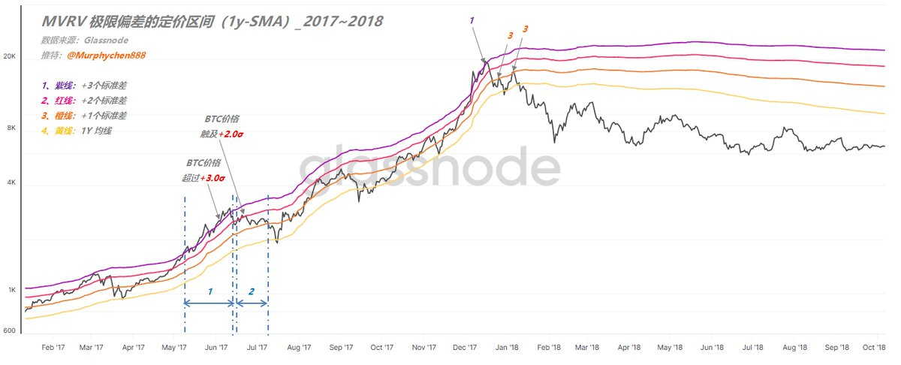
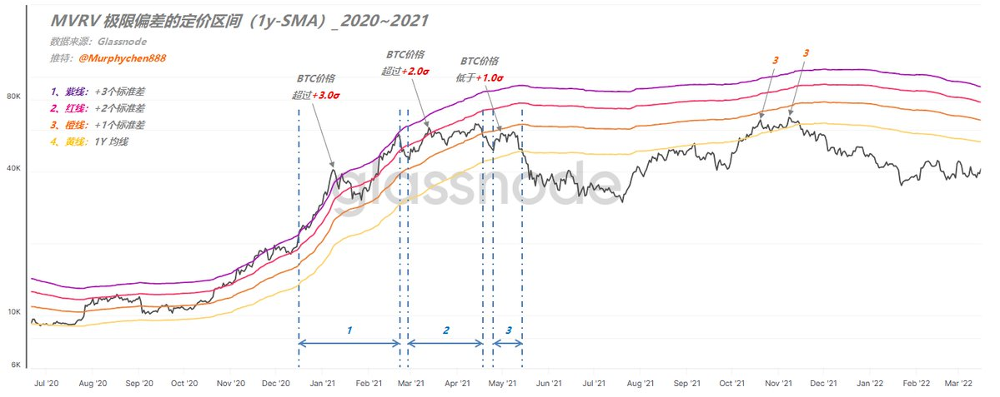
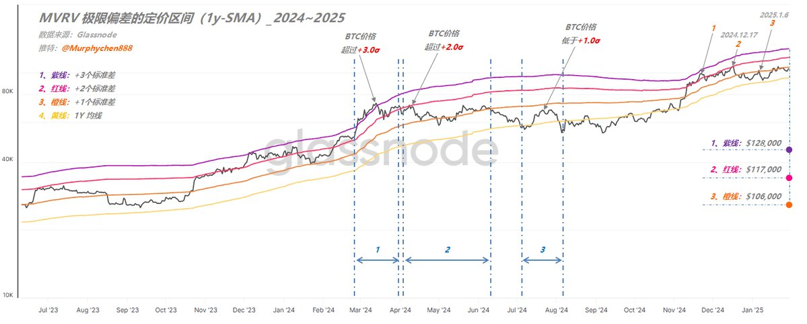

### 用极限偏离带观察一轮趋势的定价区间（20250203）

🔹前 言

这是一篇本应在2天前就写完并发出的推文，如果是，它将能极大程度的帮助小伙伴们避免不必要的损失。但春节期间的串门走亲，喝酒聊天，严重影响了我的工作效率。可惜没有如果......对不起.....

事已至此，我考虑再三还是决定把文章发出来。马后炮的话多说无益，但数据中真实体现出的趋势运行规律却不仅仅只针对当下，对未来一段时间内都会具有较高的参考价值。

🔹正 文

虽然说无人能“预测”未来，但我们可以根据采样回测、数据验证及概率统计，来“推测”未来一段时间内可能存在的趋势运行规律。

采样回测，即尽可能多的采集历史上具有相同特点的数据作为参考点。
数据验证，是需要找到一把“标尺”，让趋势中的势能变化能够更加的可视化。这个“标尺”就是MVRV 1y-SMA；
概率统计，是用正态分布法中的标准差来刻画出几个极限偏离带，并以此为参照物，对BTC的一轮趋势行情中BTC价格着落点进行分析比对。

下图1-图3分别是过去10年BTC的3轮大周期中大级别趋势行情从启动到结束的演变过程。

图中4种颜色曲线分别表示：
1、紫色线：极限偏离+3个标准差（+3σ）
2、红色线：极限偏离+2个标准差（+2σ）
3、橙色线：极限偏离+1个标准差（+1σ）
4、黄色线：MVRV 1年均线

如果从概率的角度来看，1σ 的范围表示1年的数据点落入该区间的概率约为68.27%。而 2σ 则覆盖约 95.45% 的数据着落点，3σ 覆盖约99.73%的数据着落点。

覆盖面越大，说明数据点超出覆盖范围的概率就越小。选用MVRV 1y-SMA作为基础数据的优点是可以排除某一天或某几天的突发异常对整体的干扰，以确保对定价区分的颗粒度更加客观和细致。

🔹2013~2014周期

图1

🔹2017~2018周期

图2

🔹2020~2021周期

图3

通过仔细观察，我们可以得出以下几个结论：

🚩1、在每一轮趋势的第一波势能都能让BTC价格突破紫线（即超过+3.0σ）；
🚩2、当第2波趋势无法突破紫线时，则后面都无法再形成突破，意味着势能开始衰减；
🚩3、尽管趋势衰减，但不代表价格就立刻开始反转，甚至还能出现新高。但此时BTC价格最多只能突破红线（即超过+2.0σ）；
🚩4、当第3波无法突破红线，则后面都无法再突破；此时BTC价格最多只能突破橙线（即超过+1.0σ）；
🚩5、依此类推，层层递减，直到这轮趋势结束。

🔹2024~2025周期

图4

如果我们用同样的逻辑来观察本轮周期中分别在24年1月和10月出现的2次大级别趋势行情，同样能得出上述相同的观察结论。

截止到1月31日，紫线对应BTC的价格为：$128,000；红线为：$117,000；橙线为：$106,000

‼️ 我们先假设，这个延续了10年，在4轮周期中始终存在的趋势运行规律仍然有效，那么......

本轮趋势走到现阶段，我们是可以明显看到逐步衰减的程度，这会使BTC的价格已无法再突破紫线（+3.0σ），即无法高于$128,000（根据上述观察结果2）；

由于BTC价格在2024.12.17的反弹中只是触碰到红线（如图4），且此后未再触碰；到了2025.1.6的反弹中，就只能触碰到橙线（相对位置已经越来越低）。

因此，按这个趋势发展，后面的反弹最多只能突破橙线（+1.0σ），亦或是接近红线（+2.0σ）；即高于$106,000，或是低于$117,000（根据上述观察结果4）；

‼️ 如果我们结合最近这段时间的价格走势，每当触及$106,000大饼就会走的很纠结，似乎正在印证这一趋势运行的规律。所以我目前认为这个规律仍然有效。

也许，要再次突破紫线，我们需期待下一次大级别趋势中能否实现了......

这个数据模型的底层逻辑是：

当势能和方向一致时，就产生了趋势。紫红橙黄4线，就是反映势能的延续和测量强弱的标尺。第一波势能最强，价格突破紫线，这是确认强趋势的表现。到后面，价格即便出现新高，但到不了紫线，说明势能减弱了。

本质上，就是市场的换手成本越来越高，后续进入的资金和需求无法维持高位。所以价格高了，势能反而低了。

---------------------------------------------

🔹总结：

通过以“MVRV极限偏差带”的定价区间为参照物，让我们能更清晰的观察到一轮大级别趋势行情从启动到结束的整个演化过程，让数据可视化；也可以帮助我们更深刻的理解什么是“趋势衰减”。

这对趋势交易者做出正确的交易决策，合理把握止盈点有着极其重要的指导意义。

最后给出几点个人观点：

1、小伙伴们看完全文后，要保持理性，尤其是在短线快速下跌时。这只是恐慌情绪的释放。

2、不要过于纠结牛还在不在。在未来，周期的界限会越来越模糊，我们应该把关注点放到每一轮趋势上。

3、趋势总会起起伏伏，周而复始。即便在某一轮趋势中出现了衰减，其过程也是有多次的反弹和冲高。

4、反弹和冲高才是我们要考虑离场的时机。就像文中所述，目前我们还有机会看到BTC价格再触碰橙线（甚至红线）

5、但反过来说，如果下一次反弹也只能触碰到橙线，就更加验证了趋势衰减的程度。

‼️ 我分享的内容仅用于交流和研究，不作为投资建议 ‼️

-------------------------------------------

中所提到相关推文链接如下，强烈建议新来的小伙伴优先阅读：

逃顶2025 ——“链上数据”的实际应用（6）
https://x.com/Murphychen888/status/1854746451852902655

阶段性“趋势衰减”的信号首次出现
https://x.com/murphychen888/status/1865928679416832428?s=46

阶段性“趋势衰减”信号（续）—— 历史数据回测及应对方法解析
https://x.com/murphychen888/status/1867072568206954645?s=46
