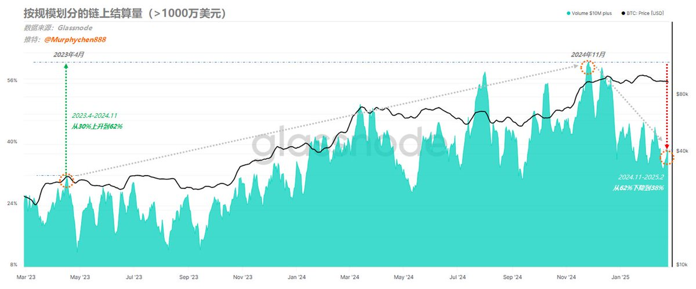

### 用极限偏离带观察一轮趋势的定价区间（20250203）

🔹前 言

这是一篇本应在2天前就写完并发出的推文，如果是，它将能极大程度的帮助小伙伴们避免不必要的损失。但春节期间的串门走亲，喝酒聊天，严重影响了我的工作效率。可惜没有如果......对不起.....

事已至此，我考虑再三还是决定把文章发出来。马后炮的话多说无益，但数据中真实体现出的趋势运行规律却不仅仅只针对当下，对未来一段时间内都会具有较高的参考价值。

🔹正 文

虽然说无人能“预测”未来，但我们可以根据采样回测、数据验证及概率统计，来“推测”未来一段时间内可能存在的趋势运行规律。

采样回测，即尽可能多的采集历史上具有相同特点的数据作为参考点。
数据验证，是需要找到一把“标尺”，让趋势中的势能变化能够更加的可视化。这个“标尺”就是MVRV 1y-SMA；
概率统计，是用正态分布法中的标准差来刻画出几个极限偏离带，并以此为参照物，对BTC的一轮趋势行情中BTC价格着落点进行分析比对。

下图1-图3分别是过去10年BTC的3轮大周期中大级别趋势行情从启动到结束的演变过程。

图中4种颜色曲线分别表示：
1、紫色线：极限偏离+3个标准差（+3σ）
2、红色线：极限偏离+2个标准差（+2σ）
3、橙色线：极限偏离+1个标准差（+1σ）
4、黄色线：MVRV 1年均线

如果从概率的角度来看，1σ 的范围表示1年的数据点落入该区间的概率约为68.27%。而 2σ 则覆盖约 95.45% 的数据着落点，3σ 覆盖约99.73%的数据着落点。

覆盖面越大，说明数据点超出覆盖范围的概率就越小。选用MVRV 1y-SMA作为基础数据的优点是可以排除某一天或某几天的突发异常对整体的干扰，以确保对定价区分的颗粒度更加客观和细致。

🔹2013~2014周期

图1

🔹2017~2018周期

图2

🔹2020~2021周期

图3

通过仔细观察，我们可以得出以下几个结论：

🚩1、在每一轮趋势的第一波势能都能让BTC价格突破紫线（即超过+3.0σ）；
🚩2、当第2波趋势无法突破紫线时，则后面都无法再形成突破，意味着势能开始衰减；
🚩3、尽管趋势衰减，但不代表价格就立刻开始反转，甚至还能出现新高。但此时BTC价格最多只能突破红线（即超过+2.0σ）；
🚩4、当第3波无法突破红线，则后面都无法再突破；此时BTC价格最多只能突破橙线（即超过+1.0σ）；
🚩5、依此类推，层层递减，直到这轮趋势结束。

🔹2024~2025周期

图4

如果我们用同样的逻辑来观察本轮周期中分别在24年1月和10月出现的2次大级别趋势行情，同样能得出上述相同的观察结论。

截止到1月31日，紫线对应BTC的价格为：$128,000；红线为：$117,000；橙线为：$106,000

‼️ 我们先假设，这个延续了10年，在4轮周期中始终存在的趋势运行规律仍然有效，那么......

本轮趋势走到现阶段，我们是可以明显看到逐步衰减的程度，这会使BTC的价格已无法再突破紫线（+3.0σ），即无法高于$128,000（根据上述观察结果2）；

由于BTC价格在2024.12.17的反弹中只是触碰到红线（如图4），且此后未再触碰；到了2025.1.6的反弹中，就只能触碰到橙线（相对位置已经越来越低）。

因此，按这个趋势发展，后面的反弹最多只能突破橙线（+1.0σ），亦或是接近红线（+2.0σ）；即高于$106,000，或是低于$117,000（根据上述观察结果4）；

‼️ 如果我们结合最近这段时间的价格走势，每当触及$106,000大饼就会走的很纠结，似乎正在印证这一趋势运行的规律。所以我目前认为这个规律仍然有效。

也许，要再次突破紫线，我们需期待下一次大级别趋势中能否实现了......

这个数据模型的底层逻辑是：

当势能和方向一致时，就产生了趋势。紫红橙黄4线，就是反映势能的延续和测量强弱的标尺。第一波势能最强，价格突破紫线，这是确认强趋势的表现。到后面，价格即便出现新高，但到不了紫线，说明势能减弱了。

本质上，就是市场的换手成本越来越高，后续进入的资金和需求无法维持高位。所以价格高了，势能反而低了。

---

🔹总结：

通过以“MVRV极限偏差带”的定价区间为参照物，让我们能更清晰的观察到一轮大级别趋势行情从启动到结束的整个演化过程，让数据可视化；也可以帮助我们更深刻的理解什么是“趋势衰减”。

这对趋势交易者做出正确的交易决策，合理把握止盈点有着极其重要的指导意义。

最后给出几点个人观点：

1、小伙伴们看完全文后，要保持理性，尤其是在短线快速下跌时。这只是恐慌情绪的释放。

2、不要过于纠结牛还在不在。在未来，周期的界限会越来越模糊，我们应该把关注点放到每一轮趋势上。

3、趋势总会起起伏伏，周而复始。即便在某一轮趋势中出现了衰减，其过程也是有多次的反弹和冲高。

4、反弹和冲高才是我们要考虑离场的时机。就像文中所述，目前我们还有机会看到BTC价格再触碰橙线（甚至红线）

5、但反过来说，如果下一次反弹也只能触碰到橙线，就更加验证了趋势衰减的程度。

‼️ 我分享的内容仅用于交流和研究，不作为投资建议 ‼️

---

中所提到相关推文链接如下，强烈建议新来的小伙伴优先阅读：

逃顶2025 ——“链上数据”的实际应用（6）
https://x.com/Murphychen888/status/1854746451852902655

阶段性“趋势衰减”的信号首次出现
https://x.com/murphychen888/status/1865928679416832428?s=46

阶段性“趋势衰减”信号（续）—— 历史数据回测及应对方法解析
https://x.com/murphychen888/status/1867072568206954645?s=46

---
2025-02-27左右

该来的还是来了。BTC终究没有回到STH-RPC之上 —— 这一衡量趋势健康的最后一道标准线。意味着24年10月开启的本轮趋势在结构和情绪上皆被破坏。接下来即便短期内能再回到STH-RPC以上，也可能出现类似假突破，或围绕STH-RPC来回拉扯，震荡下行等多种复杂的不确定性。

昨天有很多小伙伴在我的评论区留言表示，很后悔没有在我提醒“趋势衰减”时进行减仓或止盈，从这一点上看，当前行情确实让大家的信心备受打击。然而我们通过数据监测却发现，即便是信心受损但似乎并没有“逼”出太多的恐慌盘。

（图1）

图1是实体调整后的已实现亏损数据，它剔除了同一实体的多地址互相转账的情况，使得数据还原度更高。可以看到昨天产生的已实现亏损为5.5亿美元，BTC从9.6w跌至8.8w（-8.3%）。这个恐慌出逃的规模要远小于2024.8.5当天13.4亿美元的已实现亏损。

在近一年内，与2025.2.3和2024.7.5的体量几乎相同，2025.2.3 BTC经历一波从10.5w回调至9.7w（-7.6%），已实现亏损为5.1亿美元。2024.7.5 BTC从6.3w回调至5.7w（-9.5%），已实现亏损为5.8亿美元。

从数据上看我只能说算“中规中矩”，但有2个背后的逻辑值得我们思考：

🚩1、此时高位套的牢筹码似乎并不太愿意亏损卖出。或许是还不够绝望，短期的下跌并未击溃内心最后的防线，因此我没有看到明显的彻底的出清。

🚩2、也许这些亏损筹码都在期待后期的反弹，那么这些高集中度的套牢筹码势必会成为潜在的抛压。当大多数人都在预期时，往往我们就要降低可实现的预期值。

那什么样的数据是“好”数据呢？

🚩1、阶段1，有一个从小到大的过程：就像2024.7.5先测试一次市场的心理承受度，再到2024.8.5彻底击溃，将恐慌盘出清。

🚩2、阶段2，有一个从大到小的过程：当恐慌盘被逼出后，即便价格继续下跌，但所产生的已实现亏损会越来越少。

当同时具备或至少具备其中一条时，我们可以认为市场已从“极度危险”转为“相对安全”，并具备了逐步蓄势的条件。

因此现在我无法判断这里是不是底，或是价格的底，还是情绪的底？都需要更多的时间和数据来观察和判断。接下来或许会比较难，难交易，尤其是对反弹的把握更难，因为当你期待解套就跑的时候，其他人也和你一样的想法。

#### BTC波动性放大的罪魁祸首

在没有特别大的抛压且宏观上也没有利空消息的前提下，BTC的波动性放大了。其中的原因有2个：一是杠杆清算，快速下跌让多头合约连环爆仓，并引发连锁反应。我想这个数据应该不需要我来罗列，小伙伴们都知道。而我要说的重点是第二个原因，即流动性枯竭！

当前市场缺失流动性，小伙伴们应该也知道。但我想大家可能不知道的是这些正在逐渐退出的流动性中资金规模的组成占比。

（图1）

图1是按规模区分的BTC链上结算量，我将所有小于100万美元（散户群体）的放在一起。在2023年9月之前，链上流动性中散户群体参与占比达到57.5%，随着BTC的价格越来越高，以及ETF的通过，这个占比开始下降；在2024年12月最低点时只剩28%。

此后，BTC在10w美元上下盘整，而该群体在流动性中的占比却开始回升，截止到2月已经回到36%了。说明当时散户群体被众多媒体宣传而洗脑，开始Fomo更高的价格预期，积极入场承接高位筹码。那么此时的大户们又在干什么？

（图2）

图2是金额大于1000万美元（鲸鱼群体）的链上结算量；可以看到整体趋势和散户群体正好相反。从2023.4到2024.11，鲸鱼群体在流动性的参与度从30%上升到62%。这充分说明本轮周期越来越多的大资本参与博弈，也是BTC能从2.6w美元一路拉升到10w美元的最大功臣。

而随着BTC突破10w美元之后，鲸鱼群体参与度占比开始下降；从2024.11到2025.2，占比从62%又下降到了38%。很显然，当散户群体开始憧憬BTC将很快达到20w美元甚至更高的时候，大资金正在逐渐退出流动性。也应了那句经典名言 —— 任何Fomo都是为了资本的有序退出。

（图3）

另外，还有一组是大于100w小于1000w美元的高净值群体。这个群体在市场流动性的变化幅度并不大，但从参与度占比的变化能看出他们与鲸鱼群体的行为表现更接近。高净值群体从2025年1月开始逐渐退出流动性，到目前为止已经从36%下降到30%。

🚩从以上数据的观察中，我们可以得出一个结论：

即当市场流动性开始衰退时，首先退出的是拥有超大资金体量的鲸鱼群体，他们的背后往往拥有更强大的资源和团队，以及远超常人的信息获取能力。随后，高净值群体也开始退出，只有散户群体后知后觉。

当流动性严重缺失，且大量筹码还集中在一个狭小的范围内，价格的波动性就会放大。

那么谁是罪魁祸首呢？...... 大资金吗？没有他们的参与，BTC应该到不了10w。散户吗？也不是...... 这就是市场，当你不能制定规则的时候，只能选择跟随。

大资金逐渐退出流动性是有道理的，我们从另外一组数据就能看出一些端倪。

（图4）

图4是按钱包大小划分的已实现利润。我把拥有1k-10w个BTC的鲸鱼罗列在一起，可以非常明显的看到，从2017年到2025年的3轮周期中，每当大钱包开始密集兑现利润，便是一轮趋势强势启动的时候。随着利润出逃越来越少，趋势就进入尾声了。

所以这个数据可以和大资金退出流动性数据相互印证；当大量的利润完成兑现（获利了结）后，他们的参与度占比自然就会下降。

### 🔹总 结：

#### 1、在市场流动性萎缩的过程中，鲸鱼群体的退出带来的影响最大，对原本就不充裕的流动性来说更是雪上加霜。
#### 2、BTC已逐渐成为资本博弈的战场，谁的拳头硬谁就说了算，当鲸鱼们纷纷完成了利润兑现时，本轮趋势自然无法再维持很久。
#### 3、在24年5月鲸鱼群体也同样出现过参与度占比下降到27%的情况，但到了8月和10月他们回到了58%。因此，现在的退出不代表将来不会回来。
#### 4、要说现在就直接走熊也不至于，当前鲸鱼群体参与度38%，而24月5月时最低只有27%，当时退出的更厉害。因此，我个人认为本轮趋势的结束不代表没有下一轮趋势，所以我们现在也不必过度悲观。
#### 5、盯住这些超级大户们，当他们开始悄悄转变之时，也就是我们应该做出决策之际。

‼️ 我的分享仅用于学习交流，不作为投资建议 ‼️