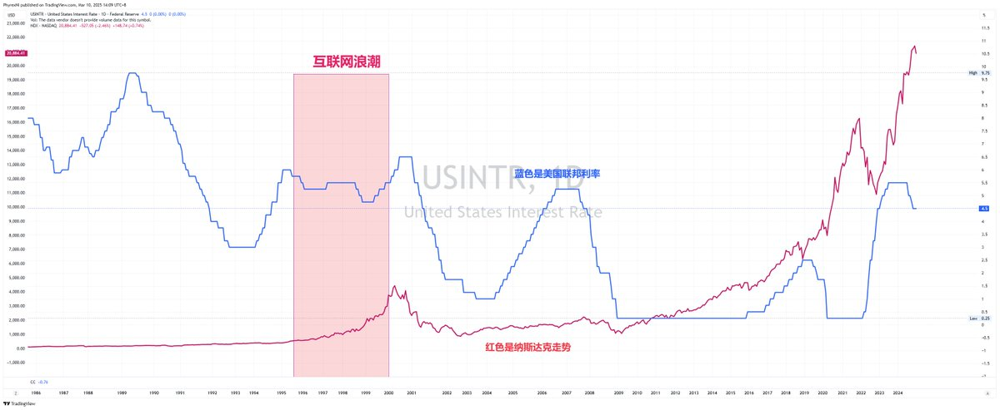
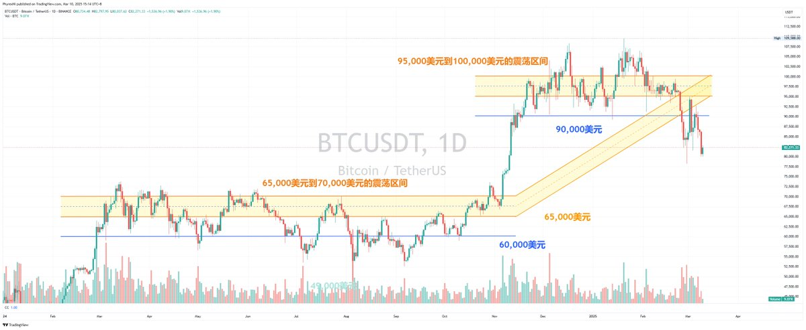
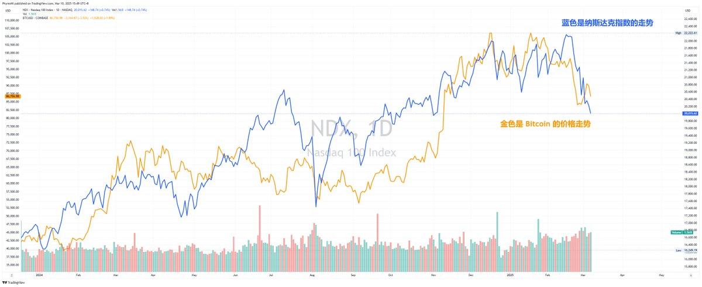

现在既不是标准的牛市，也不是完全的熊市，但确实短期距离熊市会更近一些，而长期来看未来的2至3年内必然会进入牛市。

目前 Bitcoin 的实际价格支撑大概在 70,000 美元上下，这是在不考虑衰退的情况下。

下面开始是正文，多数小伙伴可以跳过不看，对价位没有什么帮助。

首先，为什么要纠结熊市还是牛市呢？

因为在不同的周期中买卖的策略不同，牛市的时候每一次下跌都是抄底的机会，而熊市中更加重要的是对于仓位的判断，虽然都是抄底，但抄底的方式和力度必然是不同的。

其次，牛市开启的条件是什么？熊市开启的条件又是什么？

很多小伙伴习惯用价格的涨跌来判断牛熊，这并不能说是错的，但单纯的价格判断很难在涨跌变化的时候给予准确的指导。所以我们先讲讲牛市需要的条件。

1. 货币宽松的环境。
2. 近似于零的低利率。
3. 量化宽松和/或扩表。
4. 经济处于正向发展。
5. 美元指数（DXY）下降。
6. 政府政策刺激。

其中除了排名第一的货币宽松以外，其它的都没有先后顺序，而且基本上在满足货币宽松的情况下，3，4，5 都是非常容易实现的，所以货币宽松可以看作是进入牛市的主要但非必要条件。

为什么说货币宽松是非必要条件呢？

因为货币宽松是一个持续的动作，而不是一个最终的结果，在货币宽松动作的时候往往会有一个很长的跨越周期，在这个跨越周期的时候什么事情都可能会出现，尤其是货币宽松并不等于零利率或者是低利率。

货币宽松的核心是降低资金成本，提高市场流动性。

那么如何降低资金成本呢？常用的往往有三个方式：

1. 降息

降低基准利率（如美联储的联邦基金利率），让银行贷款成本下降，促进消费和投资。

2. 量化宽松

央行购买长期资产（如国债、抵押贷款证券 MBS），直接向市场注入资金，增加货币供应。

3. 扩表

央行通过增加资产负债表规模（即持有更多债券、MBS等资产），向市场释放流动性。

所以可以得知降低资金成本，提高市场的流动性就是货币宽松的本质，那么现在在什么阶段想来很多小伙伴都非常的清楚，目前是在降息阶段，但仅仅是处于降息的初级阶段，美联储从进入降息到现在一共就降息了三次，共100个基点，当前的联邦基金利率仍然高达4.5%，在历史上也是处于高位。

而，2和3别说还没有发生，就是缩表都没有停止，而缩表又是熊市的标志之一，虽然缩表并不能完全等于熊市，但缩表限制了流动性，本身就和牛市的流动性宽松相违背的，所以本质来说：

现在仍然是处于 高利率 + 流动性限制 的情况下，这种情况下并不完全符合牛市的标准。

我知道很多小伙伴想要说什么，如果不是牛市美股怎么能接二连三的突破新高，如果不是牛市 Bitcoin 怎么能接二连三的突破新高。

是的，如果单纯的从价格来看，确实现在应该是牛市，但是如果将目光稍微扩散一下，美股不仅仅看七姐妹，加密货币行业不仅仅看 #Bitcoin 和少数的几种突破新高的资产来说，现在确实并不符合牛市中全面上涨的预期，就拿我经常举例的美股耐克 $NKE 来说，全球500强企业正好排名在中间的水平，但是美股的新高 Nike 不但没有上涨，反而还持续在底部，就连 麦当劳 和 百思买 都不是一帆风顺的，即便是500强排名前茅的 联合健康集团 股价都没有上涨的那么好。

而加密货币行业大家就更清楚了，除了 $BTC 以外，在这个周期破前高的加密货币就更少了，也就是 $BNB $XRP $SOL 等有限的几个，更重要的是这次在叙事上并没有新的突破，很多人认为链上牛市的 Meme 到现在实际盈利的投资者和过往的牛市相比还是有些差距的。

但如果否认现在是牛市，为什么价格又能接连的突破新高呢，这不是矛盾吗？

其实并不是矛盾的，历史上也并不是没有过先例，这个先例就是互联网浪潮。

从图中来看是不是和现在挺相似的。都是从利率上升的时候就开始了上涨，然后再暂停加息和暂停降息的时候仍然上升，最后反而是再利率回升的时候到达最高点，而利率大幅下降的时候戳破了泡沫。

其实再互联网浪潮的时候并没有量化宽松和扩表，有的就是走走停停的降息和通胀的反复，而且当时的互联网狂潮也是像现在Ai产业一样，认为是对市场的革新，当然也确实是革新，但这个泡沫还是随着2000年的美联储加息和流动性的继续紧缩而结束的，当然也是发生了经济衰退，纳斯达克指数再两年内下跌了78%。

而美联储继续加息的原因就是通胀过高。

之前我写过一篇推文，讲的是降息的时候往往会伴随经济衰退，不知道小伙伴们是否还记得，经济因为高利率而出现衰退，而衰退的出现迫使美联储加大的降息的力度，所以衰退是一把双刃剑。

衰退到底是机遇还是挑战呢？

从结论来说，如果没有衰退可能很难有量化宽松（QE）的出现，QE的本质是为了让美国经济快速的摆脱衰退，也就是我们常说的放水，虽然并不是说只有放水才是牛市，但放水必然会伴随着牛市的到来，而QE的启动条件基本都是在零利率或者是低利率（0.25%）的情况下。

而这一次鲍威尔已经明确的表示如果利率不降低到零是不会启动QE的，但利率到零并不是启动QE的必要条件，衰退和重振才是美联储选择QE的原因，甚至是主要原因。

但衰退带来的就是大幅下跌，衰退导致的标普500下跌平均在50%左右，而目前才10%，所以如果是衰退的话，那么标普500才仅仅是下跌的开始，或者用一个更明确的说法，如果衰退了美国股市进入熊市的概率是无限大的，实际上美国最近12次的经济衰退中，除了额外的一至两次，其它的都是深度熊市。

衰退为什么是机遇呢，因为衰退是降低通胀最好的方案，几乎没有之一，而往往美联储为了应对衰退而开启快速降息，并且为了刺激经济会提前终止缩表，并且在降息的后期开启扩表模式。这种时候就是风险市场大幅上涨的时候。

回到重点，现在处于牛市吗？

1. 货币宽松的环境。

现在是从货币紧缩到货币宽松进行中，甚至还是处于较为紧缩的阶段，所以从本质来说，现在并没有进入到货币宽松的阶段，毕竟降息都被暂停了。

2. 近似于零的低利率。

现在的利率是4.5%，从历史来看仍然是处于高利率的位置，而高利率虽然并不能阻止牛市的进行，但会加速牛市的结束，也会让经济衰退出现的概率增加。

3. 量化宽松和/或扩表。

现在都没有，不但没有宽松，反而还在缩表，甚至缩表并没有暂停。

4. 经济处于正向发展。

目前美联储预测的GDP是在正向上涨，但GDPNow给出的结论则完全相反，四月的GDP数据就能知道第一季度的GDP情况。

5. 美元指数（DXY）下降。

确实最近美元指数开始下降，但下降更多的是因为担心美国经济会出现衰退的迹象，尤其是关税的增加。

6. 政府政策刺激。

虽然川普政府对AI和加密货币行业有利好的刺激，但这些利好在短期很难成为刺激行业上涨的主要原因，反而是因为政府的博弈开启了贸易战，导致了通胀可能出现反复的局面，而这种反复非常不利于经济的发展。

所以从历史和经济角度来看，现在输入并不完全的牛市，大概率是和2000年前的互联网狂潮有很高的相似度，新兴的行业刺激了市场的发展，大量的资金进入到互联网行业中，大幅的推高了估值，导致了泡沫的发生，而一旦经济出现衰退，那么面临的就是杀估值，清泡沫。

那么 Bitcoin 和加密货币也是这样吗？

如果说美股的上涨是风险市场对于新兴产业的追捧，是热钱没有了更好的出处，那么其实 Bitcoin 也是一个道理，从2023年开始，或者政策进入了暂停阶段，这时候 $BTC 的价格一直都是在25,000美元左右徘徊，而带动 BTC 价格冲破 73,000 美元，实现将近三倍上涨的主要原因是因为ETF。

情绪上的ETF可以把 Bitcoin 的价格提升到50,000美元左右，而大量传统资金的入场买入了将近200万枚 BTC 是把价格提升到了70,000美元上方的主要原因，而随着 ETF 买入的常规化，投资者情绪的回复，其实 BTC 的价格是稳定在 65,000 美元左右。

而 65,000 美元到将近 11 万美元，推手就是川普的竞选，作为第一任加密总统，川普带来的预期更多的还是在情绪上的支持，而并没有实际带来流动性上的变化。

说人话就是 25,000 美元到 65,000 美元虽然宏观流动性没有增加，但是因为ETF带来了额外的流动性，推高了 BTC 的价格，但大选却并没有带来新的流动性，而新的流动性如果不是宏观给的，那么就是：

1. 企业购买 BTC ，作为战略储备。
2. 州政府买入 BTC，作为战略储备。
3. 主权国家买入 BTC ，作为战略储备。

这三条基本上第一条在进行中，第二和第三条都是在非常早的初期，所以实际上目前这个阶段（非衰退情况下） $BTC 的实际底部支撑应该是在 70,000 美元上下。

原因就是前边说过的，因为并没有实际的带动流动性的增加，即便是抹除了川普对于 Bitcoin的竞选利好，那么 BTC 价格的回降应该是上一个阶段通过现货ETF引入流动性以后的价格锚点。

而上一个价格锚点的均价是65,000美元左右，但实际上从2024年10月到2025年2月期间，现货 ETF 是在继续买入的，而且买入的量并不少，即便是到今天还是净流入了超过20万枚 BTC ，占了整个ETF的20%左右，而这部分的买入推高 BTC 的价格到 70,000 美元左右没有什么问题。

而至于跌破 70,000 美元并不是完全没有可能，但需要有大量的抛售配合，这种抛售其实可以从交易所的持仓量以及 ETF 的持仓量来判断，起码现在并没有出现这样的迹象，而另一个矿工群体虽然也有部分的持仓，但对于价格的影响还是有限度的。

所以在没有出现大规模的 ETF 用户抛售（持仓量低于100万）的情况下， Bitcoin 的价格低于 70,000 美元的可能性并不是非常的大，即便是跌破了，也要看 ETF 投资者的态度，如果ETF投资者恐慌了，那么确实可能会继续抛售而使得价格降低，或者是交易所的 BTC 存量大幅上升，可能有抛售预期，否则 70,000 美元左右购买力的支撑还是有很大机会的。

除此以外，URPD中筹码的密集其中区也是一个非常好的参考数据，这个数据能够判断投资者的情绪支撑。

但如果是出现了衰退，那么恐慌的情绪可能会带动更多的投资者离场，那么 70,000 美元的底部就未必适用，还是要看投资者的抛售情况如何，现在就很难判断了。

那么现在是熊市吗？

前边我们用了大量的篇幅来讲，现在是不是牛市，得出的结论并不是完全体的牛市，但现在也没有完全的进入熊市阶段。

1.熊市往往都伴随着大幅且快速的下跌，往往跌幅是50%左右，而现在还没有到，最多来说可能是熊市的初期，前提是出现衰退的话，而没有出现衰退的话，现在可能就是大幅回撤洗盘的阶段。

2.经济出现回落，目前的经济从美联储的认定来看，仍然是处于小幅增涨的阶段，但如果四月份给出的GDP数据确实是大幅降低，那么也不排除是进入了熊市的初期。

3.流动性回落，用户资金撤离。在美股确实能看到大量的卖出数据，而且现在的流动性确实不好，但在加密货币行业因为更加的透明，所以在稳定币的流动性上主流的 USDT 和 USDC 暂时还没有明显的撤离迹象。

4. 失业率大幅上升，虽然川普开启了政府雇员的裁撤，但目前失业率仍然是较低的4.1%，可能需要一个季度的时间来重新计算失业率。

5.波动率指数（VIX）大幅上升，类似于恐慌指数，往往都是到40以上才是进入熊市，但现在才20左右，投资者的情绪并没有熊的厉害。

因此现在并不属于传统意义上的熊市，10%至20%的跌幅仍然能看做是短期的盘整，震荡和回调，当然也并不排除是熊市的初期。毕竟刚刚下跌的时间还有点短。

所以结合了所有的经济情况和历史周期来看，现在既不属于传统的牛市，也不属于进入熊市，而是处于新兴行业的兴旺和泡沫阶段，从短期来看，进入熊市（衰退）的概率会更高，但从稍微长期一点的阶段来看，未来两三年内必然是货币宽松带来的牛市。

最关键的问题，什么情况下才是最稳妥的抄底时候？

1.货币宽松的前奏。

两个重点时间，一个是 SLR 的启动，一个是 停止 缩表。
但前提都是在经济没有发生实质衰退的情况下，而 SLR 的抄底如果是短期则可以博一波反弹，而彻底停止缩表，则尽量要配合经济状态实施。

2. Bitcoin 的价格逢低买入。

图中可以看到 BTC 和 纳指 的走势是非常相似的，一般来说，如果是回调，震荡和盘整的话，对应纳斯达克下跌在20%左右，现在是下跌10%，那就是还有10%左右的空间，对应 Bitcoin 来说，大概是75,000美元左右，但考虑到 Bitcoin 的下跌幅度大概率会高于纳指，但是 Bitcoin 到底还是有战略储备和现货ETF，所以70,000美元到75,000美元之间分批小仓位建仓可能是正确的。

但实际上现在纳指已经跌了10%，如果没有进入衰退的话，继续下跌的概率也不大，而对应 Bitcoin 的价格大概就是 80,000 美元左右，所以胆子大，钱包足的话，可以在 80,000 美元上下建仓，跌破 80,000 美元也是机会。

但还是要做好可能会存在的衰退的可能，衰退即是恐慌，也是机遇，而且衰退就是最后一跌。

3. 宏观数据节点

点阵图仍然是考验投资者情绪的判断标准，降息两次还是降息三次对于情绪的影响，起码在短期是挺重要的，当然还要看鲍威尔在点阵图以后的发布会中说什么，肯定会有记者问对于GDPNow给出的GDP数据是否有预期，不过鲍威尔大概率不会正面回答。

点阵图的影响如果是利好的话，4月份的GDP数据就是比较重要了，如果真的是负2.4%，那么交易衰退必然会到来，从Q2开始，数据对宏观的影响会越来越大，衰退还是不衰退有会是成为市场博弈的重点。

4. 价格越低越要谨慎开空

虽然这和抄底没有关系，但很多小伙伴更喜欢用合约而不是现货，所以合约的开单时间和方向也挺重要的，之前就分享了未平合约现在已经是最近一年的低点，就是代表了很多投资者对于现在的多空情绪并不非常有把握，如果经济没有衰退的话，现在开空的收益可能不够好。

当然这并不是鼓励大家去做多，因为做多一样有风险，比如长期在80,000美元左右震荡，比如真的出现了衰退，比如会有因为点阵图等宏观数据的暴涨暴跌，都可能最终方向对了，但仓位没了。

所以这种情况下适当的降低杠杆未必是错误的。虽然可能少赚钱了，但安全性提升了，毕竟活下去才有可能活的更好。

5.仓位一定要控制好

没有公开已知是从未来回来的人，所以未来如何谁也不知道，我之前就陷入了对未来预测的误区中，毕竟即便是历史重复过多次，也不代表刻舟求剑就是100%会发生的，ALL IN 虽然赚钱的机会大，但亏损的机会也很大，掌握好仓位让自己随时都有能抄底的资金才是应对极端情况下最好的方式。

结尾

大体上我能想到的就是这些了，我非常坚信随着货币宽松的进行，最晚2028年一定会摆脱现在这种流动性困局，而目前最有可能会保值的资产就是 Bitcoin ，其次就是优质的平台币，再下一档就是有真实收益的公链或项目，尤其是收益可以覆盖支出的，最后一档就是有真实落地应用场景，但因为各种原因现在还不能做到收支平衡的。