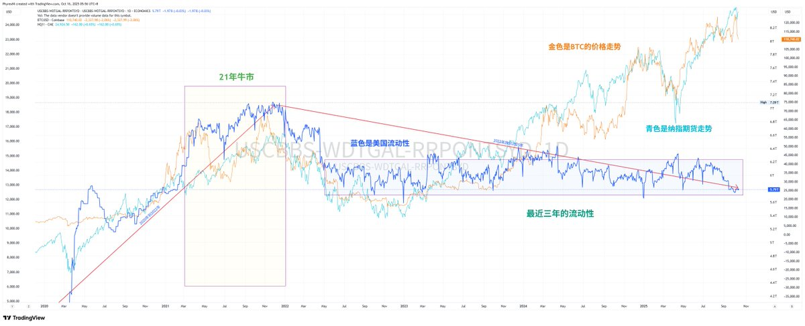
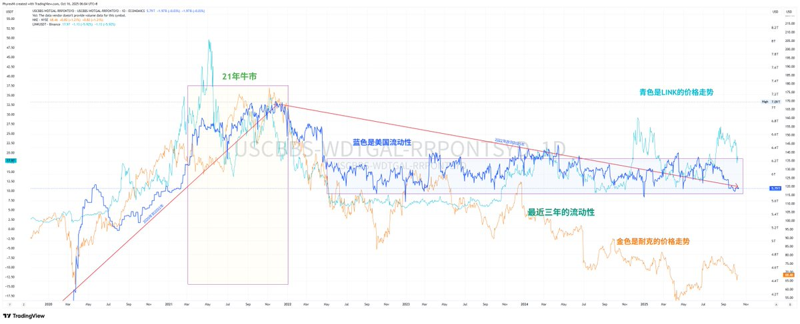
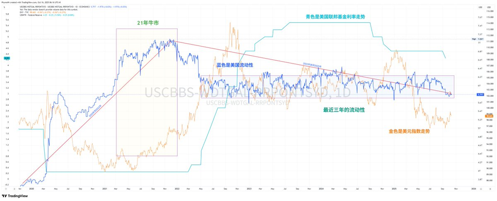
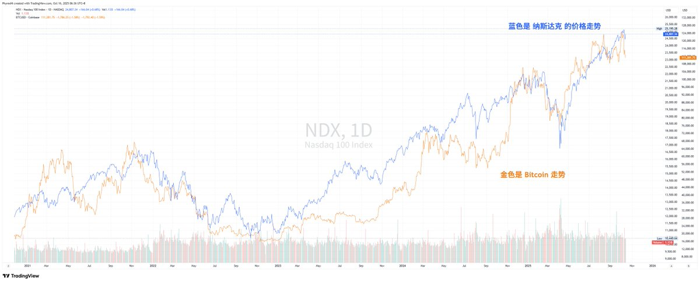

**牛市是否结束？**

这是今年第三次写这个话题了，前两次分别是在三月和八月，写完以后也分别都出现了 $BTC 的历史新高，而且不但是 Bitcoin，就连 $ETH 和 $BNB 的历史新高都出现过，也就更别说美股了。

因此，我觉得我前两次的分析没啥问题，也就让我能壮起🐕胆来聊聊这个话题。

**1. 现在是牛市吗？**

在八月推文的时候我就说过，现在并不是典型牛市，真正的牛市应该是流动性泛滥的时候，但现在的流动性，不用我说，都能知道现在的流动性不咋样，从流动性的数据中能明显的看到，目前2025年和2022年没有什么本质区别，都是较低的水平。

$BTC 和 纳斯达克指数与流动性的关系

但我们换个思路来看好像 Bitcoin 和 纳斯达克指数与流动性没有直接的关系，在2022年流动性不足，纳指和BTC是在下跌，但在同样流动没有变化的2024年以后纳指和BTC都在上涨，尤其是2025年涨的更厉害。

$LINK 和 耐克与流动性的关系

再换个思路，我标记了 Chainlink 和 耐克与流动性的关系，明显看到同样是加密货币和美股，LINK 是目前币圈最普及的预言机，也是排名最靠前的实用型的应用，而耐克就不用多说了，代表了潮流的品牌运动鞋，世界500强的企业。他们两个和流动性相比感觉会更加的依靠于流动性，流动性好，对他们来说是牛市，流动性不好，对他们来说就是熊市。

因此能得出两个结论：

A. 从流动性来说，现在并不是牛市。
B. 从BTC和美股的走势来看，现在就是牛市。

这看似矛盾的观点为什么会出现，我们判断牛市的标准到底应该是什么，又是什么帮助了BTC和美股的上涨？

从我的思路来看，毫无置疑的原因也是两个：

A. 美联储的货币政策从加息到降息。
B. 川普就任总统。

货币政策的变化虽然没有带来流动性的改善，但带来的是风险偏好的增加。

美元指数和美国利率与流动性的关系

这是一个很关键的点，首先流动性是受到货币政策的影响，而货币政策中目前已经逐渐的从紧缩走向宽松，无论在怎么说，无论美联储在怎么观望，这都是一个必然的结果，无非就是时间长短，也就是说美国进入到货币宽松是一件必然会发生的事件。

中间可能会有坑，可能不会一帆风顺，但这个时间并不会非常的长，现在流动性并没有完全释放的主要原因就是市场还没有看到美联储进入到真正的宽松，连取消 SLR 和停止缩表都还没有实施，但就像我说的，这就是早晚的事情，所以在市场的预期下，美元指数是下跌的。

当正常情况下（非衰退）美元指数下跌的时候投资者的风险偏好都会增加，投资者的资金会逐渐的从低风险的美债等（因为收益率降低）转移到风险较高的美股和加密货币，虽然在流动性上还没有完全的展现，但实际上有限的流动性已经聚焦到了热门板块的龙头。

这个板块就是AI。

**2. AI 和 加密货币的关系**

AI走到现在即是防御性的避险资产，也是能让人赚钱的风险资产，这个泡沫也许有一天会崩溃，但目前来看短时间是看不到的。因为给 AI 添砖加瓦的吹泡泡的不仅仅是风险市场，还有美国政府，还有美国总统。

川普从上任的时候就加大了政策对于 AI 和科技领域的扶持，整体以市场化、低监管、政治导向为核心，促进AI创新与产业扩张。而在同时川普做的另一件事就是将对于 AI 的扶持也套在了加密货币身上。

（这里边的内容太多了，我说了你们也看不下去，所以知道有大力扶持这件事就行了，如果不信的可以去问 AI ）

不论处于何种目的在川普的带动下美国对于加密货币有了很大的政治和政策上的支持，大大的降低了来自包括 SEC 和 CFTC 的压力，而包括AI在内的科技公司本身就是加密货币早期到现在的支持者，很多的科技公司的大佬本身都是对于加密货币很有兴趣的。

纳指和 $BTC 的相关性

因此我们能看到美股和加密货币的关联性最近几年一直是较高的，虽然偶尔难免会有些背离，但在大方向上纳指和 Bitcoin 的走势仍然是高度吻合的。而纳指现在的主力就是 AI ，代表 AI 的科技公司本身又是和加密货币最亲密的。

这种相关性在2025年尤为明显，BTC 与 纳斯达克指数 的相关系数已接近0.8，而与英伟达的52周相关性高达0.75。 其实对于很多小伙伴来说，不用太关心相关性的原因是什么。

只要知道 AI 与 BTC 都象征未来科技与反传统体系，吸引同一批高风险偏好的资金与机构，而且部分投资者将 BTC 视为纳斯达克的影子资产，约70%相关于科技股，30%于黄金就可以了。

因此我们可以带出一个结论，只要美股仍然是在牛市，科技股（AI）仍然是占据美股的主力，那么 $BTC 的走势就不会太差。

现在的问题就是变成了，如果 BTC 是进入到熊市，是不是美股也会进入熊市？这个问题仿佛就回到了 AI 的泡沫会不会被戳破一样。

我有一个假设 AI 泡沫戳爆可能就是这个周期的黑天鹅，然后直接进入衰退，再然后美联储紧急降息，大概一年后利率回到低点，美联储为了重振市场而放水。

所以对于美股的看法，我很简单，一天 AI 的泡沫没有戳破可能美国上涨的趋势就不会停止，那么和 AI 以及 科技领域高度相关的 BTC 的价格走势就不会太差。

**3. Ta的名字叫贝莱德**

贝莱德进入加密货币领域的原因一直是我很好奇的，而且我估计很难会知道准确的答案，但作为全球资管体量最大的机构，Ta就是这么进来了，不但进来了，业绩也是超过了我们很多小伙伴的想象。

总的来说 贝莱德 目前持仓的 $BTC 和 $ETH 是美国最多的，当然这不是贝莱德自己的，而是贝莱德的投资者们的，目前已经持有了 805,194.254 枚 Bitcoin 以及 3,999,704 枚 Ethereum ，这个持仓量是所有 ETF 中的第一，不但是持仓量第一，整体的资金流入数据在全球的 ETF 当中也是排名靠前的。

准确的数据我记得不清楚了，大概贝莱德 $IBIT 是前五，而 $ETHA 是前十五 ，大概是这个排名差距不会很大。

而现货 ETF 最大的优势就是投资者普遍都是长期持有的，到今天不论是 $IBIT 还是 $ETHA 的持仓量都是缓步增涨的，即便是市场情绪较差，价格暴跌的时候现货 ETF 的卖出量也非常有限，可以说现货 ETF 投资者买入的 BTC 和 ETH 基本就是半锁仓的状态。

到现在我仍然没有看到有贝莱德的投资者大量释放持仓 BTC 和 ETH 的迹象，对，确实现在购买力不够强劲，但抛售量也没有对市场产生太大的压力，因此从 ETF 和贝莱德的数据来看，我不认为现在这部分的投资者会出现逆转，大量开始抛售。

所以，从美国的货币政策到川普的支持，从 $BTC 和 美股的高度相关到 贝莱德 投资者的持仓，我确实看到了一些风险，但你说这些风险现在就会点燃，我是不太同意的。反而我看到更多的是接下来的机会。

也许会因为中美的贸易摩擦会带来市场的短期下跌。
也许会因为美国的地缘冲突会带来短期价格的下行。
也许会因为美联储的保守作风带来暂短的价格风险。

但我始终认为目前的趋势是好的，暂时还没有看到系统性的风险，川普在努力的延后经济衰退爆发的时间，起码目前，我并不认为 Bitcoin 就没有了继续上涨的可能。我也并不认为属于 $BTC 的牛市就到这里就结束了。当然我很可能是错的，但这就是我的理解，我愿意为了自己的理解去买单。

PS：写在最后。

我并不准备说服任何人，每个人都有自己的观点，我想做的只是想将我的思路表达出来，你可以认为我说的对的，也非常欢迎你的质疑，其实我是对还是错并不重要，重要的是不论接下来的是牛市还是熊市，你能不能赚到钱，能赚钱的时候就是牛市，不能赚钱，就是牛市，也毫无意义。

PS2：最后的最后。

其实我还有很多想写，想说，想聊的，但字数已经很多了，估计大多数人都看不去下了，也许我写的内容中废话很多，但这些就是我真实的想法，我并不是为了去堆字而写这么多，而是因为想要清楚的表达我的想法。我愿意去写出来，去表达出来，何尝不是我内容的真实写照。