https://quaily.com/simpleearn/p/simple-earn-manual-2-morpho-analysis

背景

Morpho 是我本轮周期最喜欢的几个项目之一（只是认可协议的价值，不是推荐买币），代码简洁备受赞誉，它把零钱理财 / 传统基金管理的元素搭配在一起，既方便活钱管理，也方便了需要有资金杠杆需求的人。

地址：https://app.morpho.org/

项目的安全性我们上一期已经讲过了，如果你想稳稳赚个利息，那根据你的资产，找到高息的 Vault，存入即可，收益秒结，随时可以撤出。

今天这期主要是在你存入之余，让你搞清楚你的资金去向，你存的 Vault 有哪些要点要关注，你的 APY 是怎么来以及怎么提升（感兴趣的话）。

INFO
中间有些用词，因为翻译不一样，专有名词我会保留英文，确保意思无误。

基础机制
首先，Morhpo 改版后，首页清楚地分为 Earn / Borrow，清晰界定两者的需求用户。

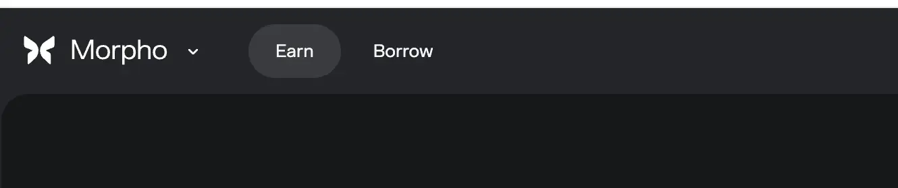

一些概念
开始之前，有些概念要先理解

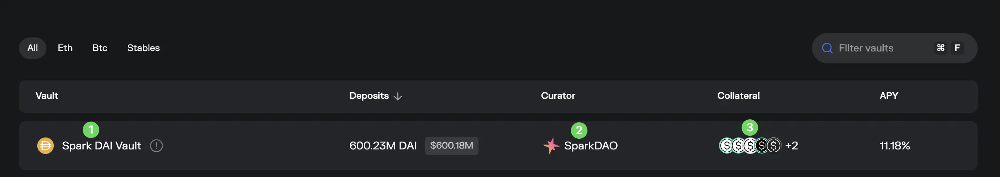

Vault：传统的借贷协议，都是以币种分类，在 Supply 的时候，你存入什么币种，利息是多少，更像银行。而在 Morpho 存入的是概念 vault，可以近似理解成某一类风格基金，有独立的基金管理员，运行着帮你管理资金的一个保险库。
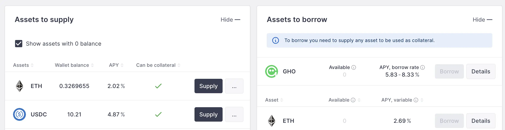
AAVE

Curator：Vault 的管理员，近似理解成基金经理，管理这个 Vault 的人或组织，是风控和实力的代表，APY 的实现策略主要制定人。

Collateral：抵押物，Vault 拿到大家的钱后出去放贷赚利息，收回来的抵押物是什么，这个在下面会详细说。

收益传递机制
借贷协议，借的人 (Supplier)，利息终究来自贷款的人 (Borrower), Morpho 上也不例外，认清这点很重要。与传统借贷协议不同的是，你以前是把钱交给了协议，协议作为撮合方；这里是你把钱交给了协议，协议保证资金安全，然后交给一个基金，基金帮你去管理，去放贷，关系简化如下，这是 Morpho 官方文档首页的这个图，多看几秒，你就了解整个协议的内核了：

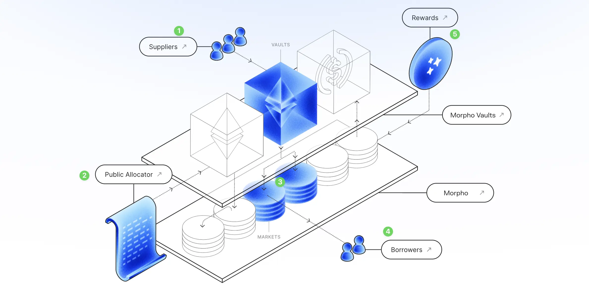

Supplier（存款人），拿着 ETH / USDC 等资产，从 Earn 里存入 Morpho Vault
通过 Public Allocator，一个经过审计的智能合约，Curator 安全地接触资金
Vault 将资金分配到对应的 Market（全称 Borrow Market，借款市场）
Borrower（借款人）从Borrow Market 中抵押资产，借出款项，支付利息
然后 Reward 机制将利息等既分配给 Market 给 vault
不懂的话，再读几遍。

Morpho 与传统借贷不一样的是：

传统借贷协议对有借款需求的人，通常要抵押大币种 or 通用型更高的资产，例如 USDC USDT ETH 等；而 Morpho 支持的例如 PT / USD0++ / Berastone 等这种适用性更低的资产作为抵押，作为借款人而言，可以提升闲钱资金利用率（抵押 PT-sUSDe 借 DAI）。
另外就是，传统借贷单一资产的风险波动影响是有可能整个协议的，例如某一资产出事，可能导致其他坏账，而 Morpho 这边是 Vault 之间互相隔离的（A Vault 出事不影响 B Vault 的资金安全）。
看懂 Earn 和 Borrow
分别从一个例子来看就懂了。

Earn 参数解读
https://app.morpho.org/ethereum/earn

首先 Earn 面对是有闲钱，想要赚利息的用户，也是大部分人的需求。这个列表展示的 Vault 都是经过官方加入白名单的，实际上创建 Vault 是谁都可以的（ Permissionless ），你和你朋友开心就可以起一个，资金安全、使用以及透明度由 Morpho 底层保证，不用担心私自挪用的问题。以及没加白名单的 Vault 不会在这个首页显示和被搜索到。

我们以 🔗 MEV Capital Usual USDC Vault 为例，逐一看下各个参数，如果你不熟悉，建议放慢速度。

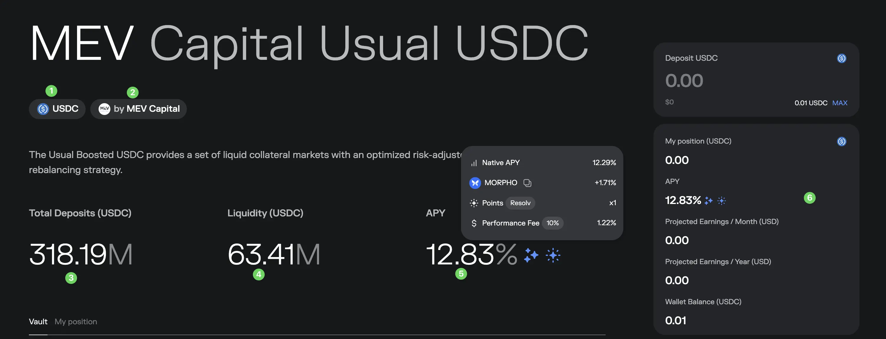

USDC: 这里表示 Vault 接受什么币种存入，这里是 USDC，其他 Vault 有 USDT / DAI / BTC LST 等币种
MEV Capital: 这个 Vault 的 Curator（管理员），一般是各种机构，可以去搜索对应机构的资质，历史、资金管理规模等，更好了解他们的风险管理能力
Total Deposits: 这个 Vault 现在总共多少资金存入，这里是 318M USDC
Liquidity: 剩余流动性，类似银行准备金，要提款的人，从这里的余额提。这里是 63M，意味着如果你之前存了 100M，你想一步全身而退，是做不到的，下面会讲 Morpho 机制怎么解决这个问题。
APY: 大部分人最关心的参数。一般由 Native APY（原生 APY）+ $Morpho 代币补贴 - Performance fee（业绩费） 组成，可能还有其他参数，例如这些显示还有 Resolv 项目的1倍积分，这个积分也许可以未来某一天换 Resolv 的奖励。
个人资产相关：你钱包里有多少钱，存入了多少，预计一个月 / 一年能赚多少。
接着往下看 Overview

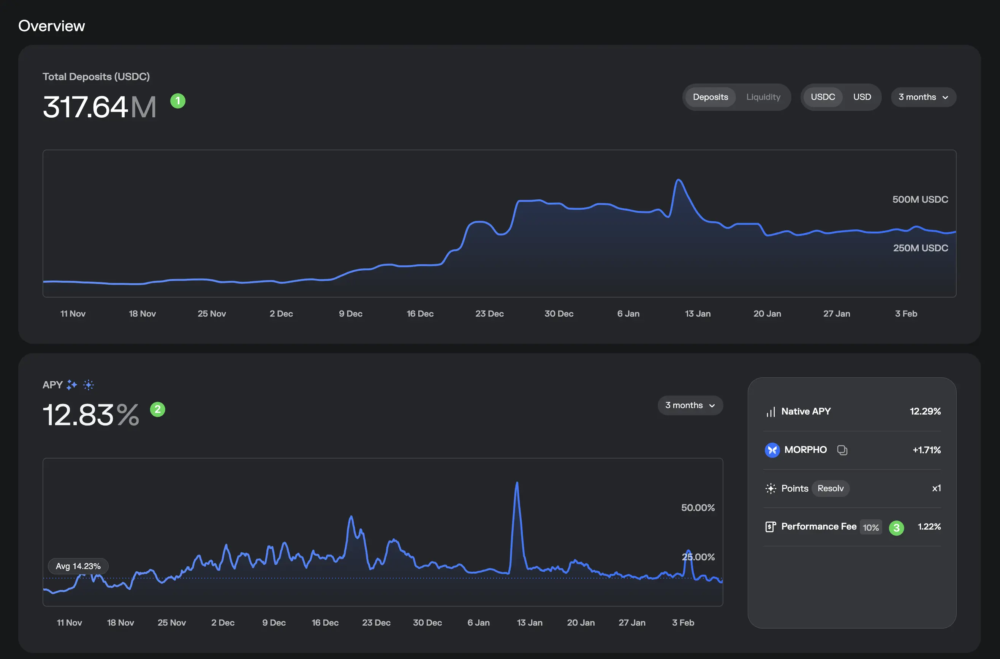

首先是存入资金的基本走势，可以切换视图，如果下降迅速，说明可能有风险在孕育，注意观察保护自己
其次是 APY 的基本走势，可以切换视图
Performance Fee（业绩费）: APY 这里值得特别关注的指标，这是 Vault 基金管理员的业绩费，从你收益中抽取，这里是10%，代表你收益的 10%，归 Vault 管理所有，根据当前 APY 换算是 1.22% 的折损。
接着往下看 Market allocation

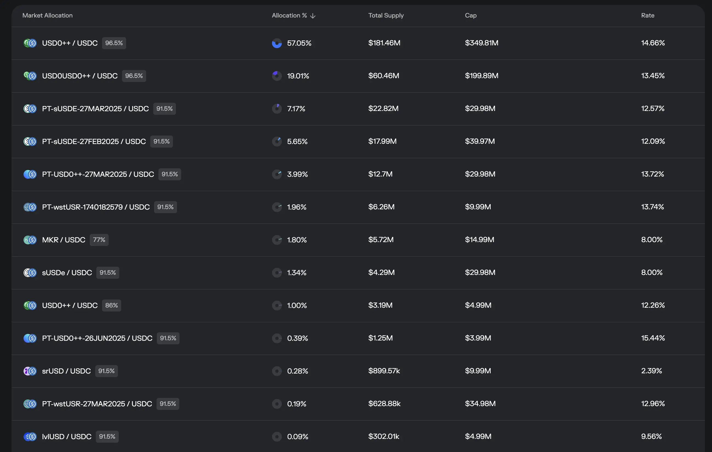

这里公开向大家展示，你存入的钱，被用作去放那些贷了，也就是你的收益来源，这就是去中心化基金吸引人的地方，公开，实时。

如图，我们看第一行，这个 Vault 的 57.05% 都在 USD0++ / USDC 这个 Market 上了，这个 Market 允许用户抵押 USD0++ 借出 USDC, 最大保证金利率是 96.5%；一共向其供应了 181.46M，策略上限是 349.81M，最近一天的 APY 是 14.66%。

其他 Market 同样的解读。这个时候你可能会想，这个部份也是不是 Vault 的核心风险来源，即 Vault 收回来的抵押品如果不值钱了怎么办？确实是的，这也 Morpho 最大的风险来源，不是来自协议本身，而是抵押品。

前段时间 USD0++ 脱锚，虽然没有发生实际的资金损害，但恐慌情绪蔓延，让许多人存进去的钱短时间内没法取出。后来经过换管理员主动注入流动性以及换 Market 的一些操作才救回来。

接着看到 Performance

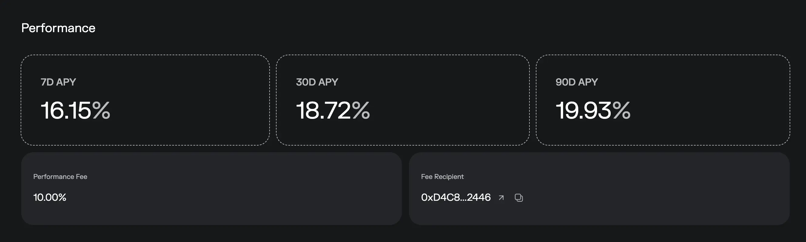

没什么好讲的，就是过往业绩，和业绩费的收款地址。

看到 Vault Configuration

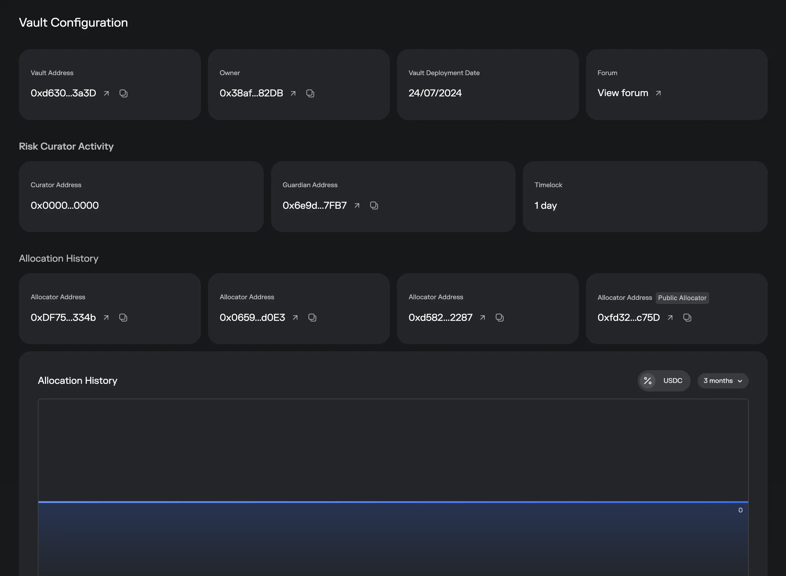

这个部份大部分都是透明度报备信息，例如 Guardian Address（守护地址） 用来监控和反授权 Vault 的一些风险操作, Timelock（时间锁）是当面临核心改动时，必须等待的最短时间，这个时间是给市场、Curator、 Guardian 的反应时间。

看到 Depositors

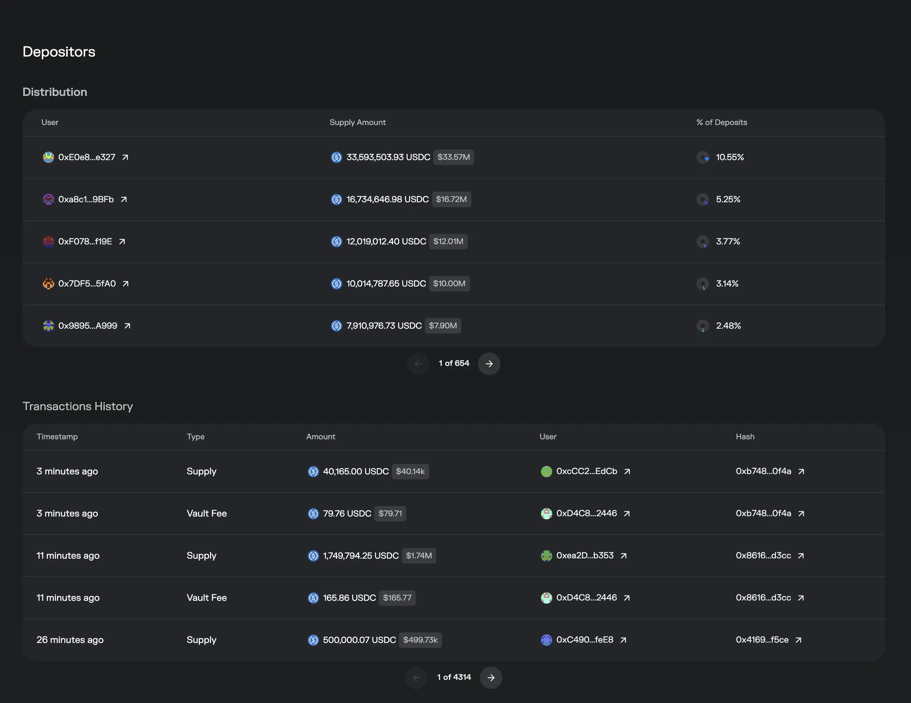

Distribution：每个用户分别存了多少钱，占比多少，大户在前面。
Transactions History：这里就是大家的存取动态。细心的朋友会发现，图里每一笔 Supply / Withdraw 交易，都会有一笔同一时间 Vault Fee 交易，这里的机制是：用户每次对 Vault 操作，都会帮助 Curator 从 Morpho 中提取已经赚到的业绩费，这也是为啥，直接交互 morpho 的 gas 还挺贵的原因之一 😂。
那以上，就是 Earn 的参数全部内容了。

Borrow 参数解读
https://app.morpho.org/ethereum/borrow

Borrow 里面的一个个池子，我们称之为 Market，一般提供给有循环贷、或其他借币需求的人。

我们以 🔗USD0++ / USDC 为例

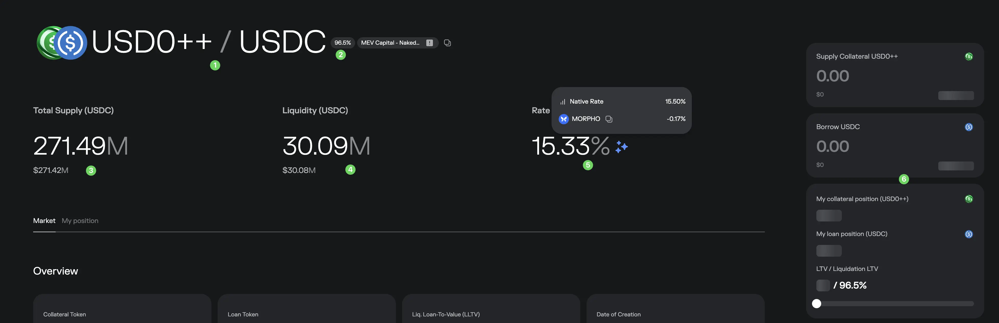

首先标题就是支持抵押 USD0++,借出 USDC

96.5%: LLTV，下面会详细说
Total Supply: 这个 Market 收到多少 Supply 进来的资金
Liquidity: 这个 Market 还有多少资金可以被借出
Rate: 借钱人需要支付的利息，原生利息是 15.5%，其中有 0.17% 的 $Morpho 补贴，所以实际低一点
你的仓位信息：抵押了多少，借了多少，LLTV 是多少，LLTV 如果你不熟悉，永远不远接近目标值，到了会触发自动清算。
在看 Overview

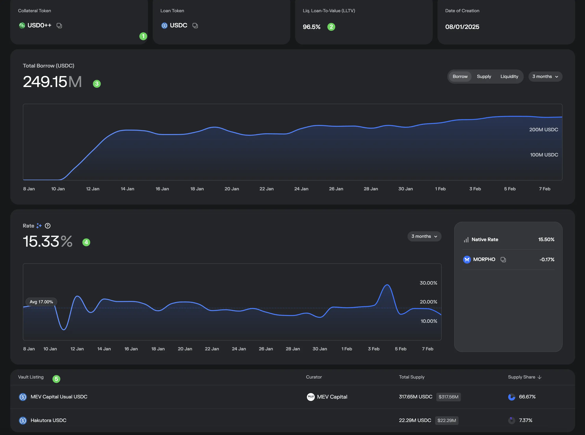

首先是抵押品和借贷资产，这里前面也说了
Liq. Loan-To-Value (LLTV): 简单理解就是清算线，当你的 借款资金价值 / 抵押品价值 = 96.5% 时，那你的抵押品将有可能被清算。为了保护抵押品安全，首先尽量不要让自己的贷款金额靠近这个值，要做好抵押品和贷款代币的价格监控，其次就是关注这个 Market 的预言机结构（两者的价格怎么决定的），下面也会讲到。
借款金额走势
借款利率走势，以及右边的计算方式
这个 Market 收到哪些 vault 的资金，同时你也会发现，图里这 2 个 Vault 的 Supply Share（供应份额），加起来并不到 100%，这是因为还有些 “个人投资者” Supply 进来，但是不算 Vault，所以没在这里展示，在下面有展示。
再看 Oracles 预言机，这部分比较复杂，有条件的可以请教有工程师或者 AI

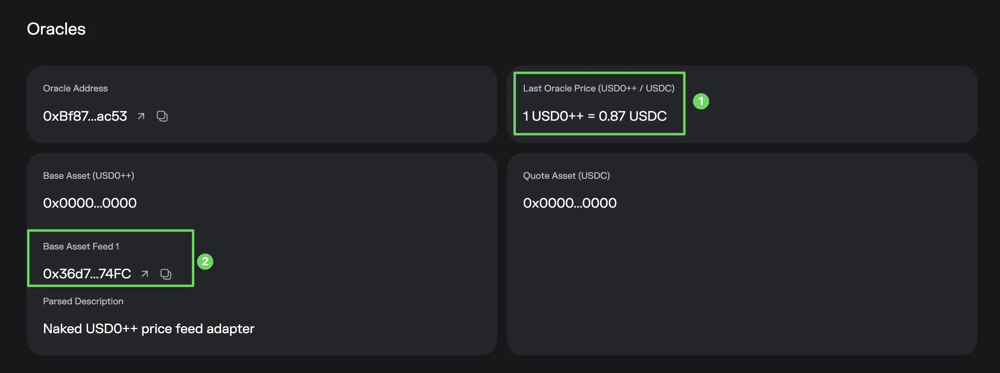

这里解释了抵押物的价格决定机制，大部分都是合约，一般人不好懂，但是可以借助 AI，例如：

1️⃣ 中告诉你最后一次价格是 1 USD0++ = 0.87 USDC

2️⃣ 中的合约告诉我们 USD0++ 价格是如何定义（问AI），它说是从 USD0++ 的合约中固定取 FloorPrice，熟悉 USD0++ 项目的都知道，它的 FloorPrice 价格目前就是写死的 0.87，这也意味着，这个价格目前是写死的，不会因为市场价格变化而变化。

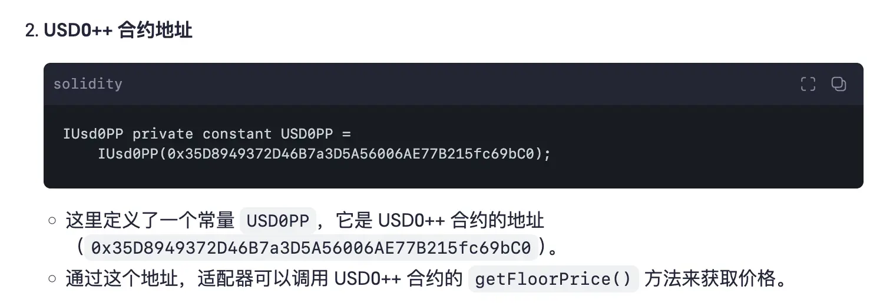

每个 Market 的预言机情况不尽相同，有的是波动的，有的是写死线性增加的。

再看 Instantaneous Rates 即时利率，这个部份非常重要。

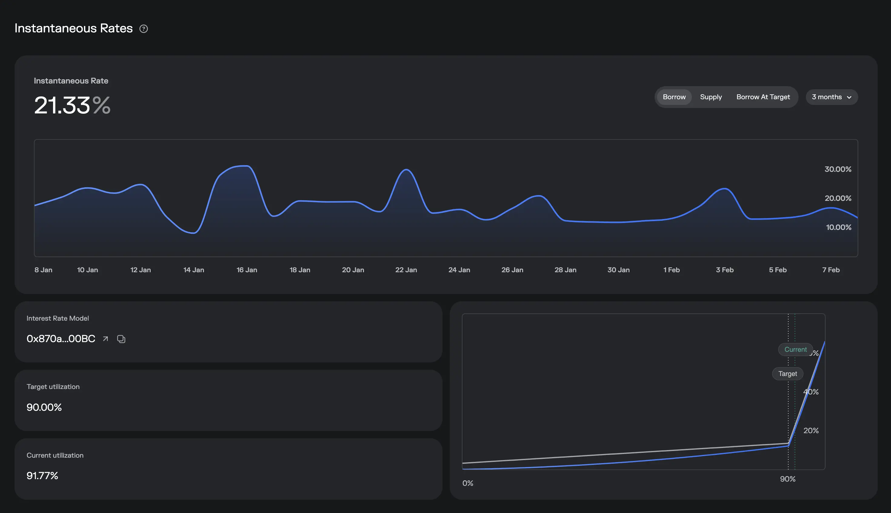

首先我们可以看到，实时的借款、供应的利率，以及走势，然后重要的参数是这个 Target utilization（目标利用率），目前是 90%，而 Current utilization（当前利用率）是 91.77%，利用率的计算就是：被借出去的钱 / Supply 的钱 ，简单数学告诉我们：被借出去越多，或者 Supply 减少，都会提高利用率。

右下角边的图形，灰色线是借款利率，蓝色线是供应利率。90% 是一个分界点，当利用率超过 90% 时，借款利率会爆涨，就是因为这个机制，保护着我们最初的问题：就是 Earn 里提到的 Vault 流动性不够我退出怎么办？用例子解释：

假设一个 Vault 把钱拿出去放贷，Supply 到了一个 Borrow Market，手上剩余流动性只有 50M ,一个大户要撤走 100M，怎么办？

假设大户先撤走这 50M，Vault 池子的流动性就没了，Borrow Market 的资金供应量因此减少，utilization（利用率）上升，借款利率上升，倒逼借款人还钱；同时 Vault APY 提升，吸引外部的人来 Supply；那借款人还钱，新人存款，继续为这个大户撤走提供资金，如此循环，最终达到一个新的平衡。

通过这个利率调控机制，来保证利率稳定，也保证大额撤资需求。

再看 Liquidations，这里的内容不多

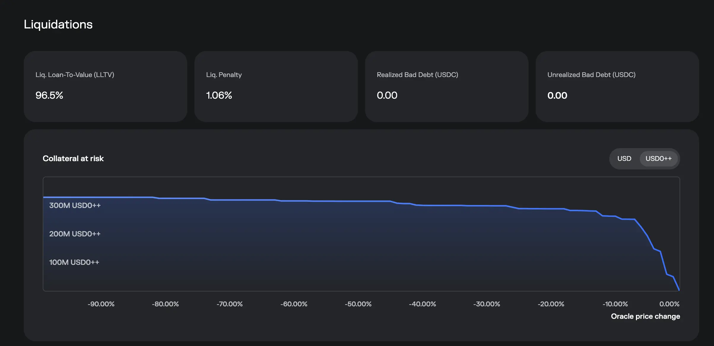

一个是 Liq. Penalty（清算罚金）

另一个是图形上，从右到左，当抵押物价格下降时，对应多少资产会有清算风险，鼠标放上去滑一滑就知道了。

再看 Market Activity 市场动态

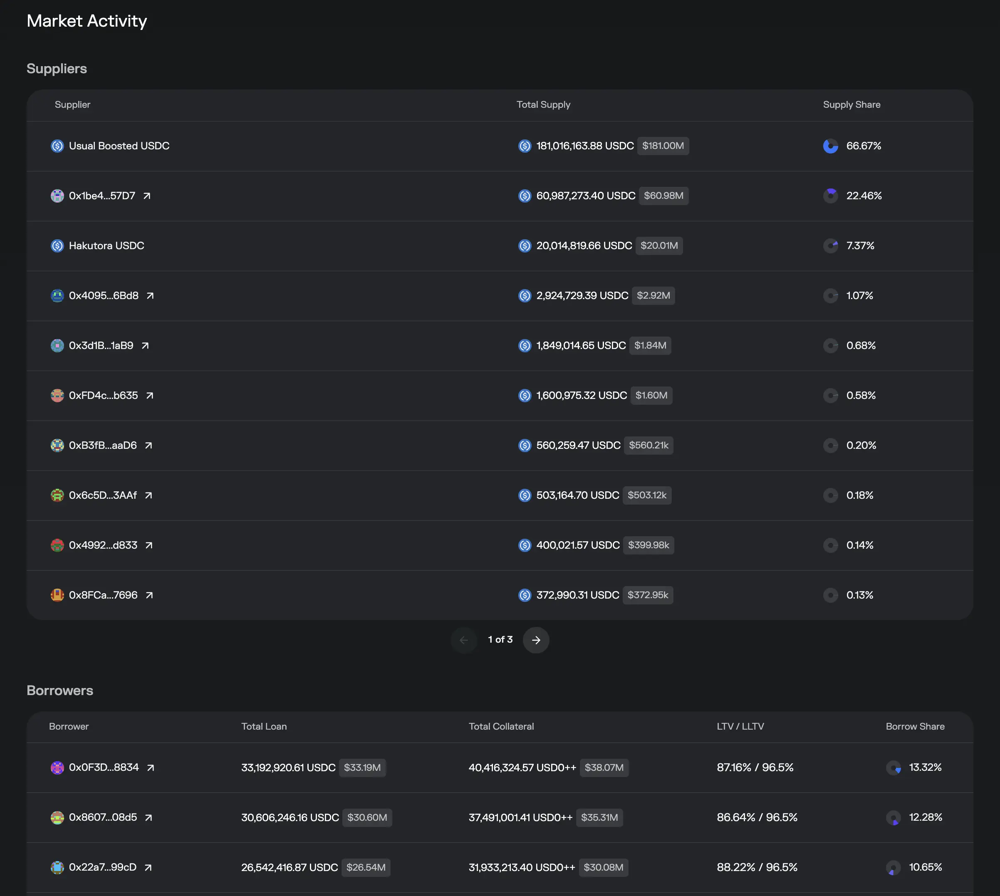

这里我们从 Suppliers 可以看到除了 Vault，还有一些个人地址（如 0x1be4...57D7 ），都往这个 Vault 里提供资金了。下面进阶的部分，我们可以看下为啥这个个人地址要这么做，以及怎么操作。

Borrower 列表就是顾名思义了，谁借钱，借了多少。

最后的 warnging（警告） 部分

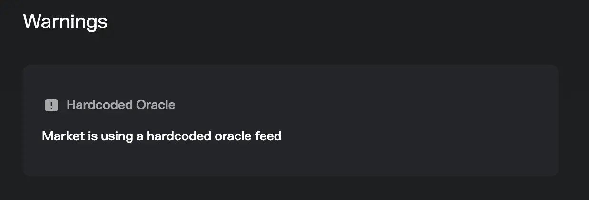

这里提示了这个 Market 可能存在的风险，例如我们上面提到，这个 USD0++ 的价格是写死的，这里有提示。并不是所有的 Market 都有这个提示，当然，有这个提示不代表非常危险，没有这个提示也不代表 100% 安全，尊重市场。

那以上，就是 Borrow 部分的全部参数解读。

至此你应该也对 Morpho 的协议有了更深的了解了，如果还不懂，再读一遍吧，我的朋友。

延伸问题：如果实际发生风险，能要求 Morpho 赔偿吗？答案是不能。（成熟的 Crypto 冲浪者早已知道）

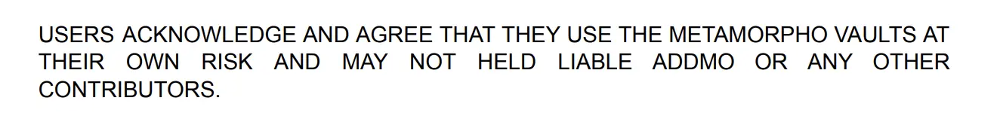
Morpho_Terms_of_Use.pdf

进阶操作：实现最高收益率 + 绕过业绩费
在讲 Borrow Market 的时候，我们知道，大部分 Market 的流动性是由 Vault 提供，而 Vault 的钱，是用户提供的。在下图，我们发现有些个人用户，直接向 Market 里 supply 了 (称之为直塞)。

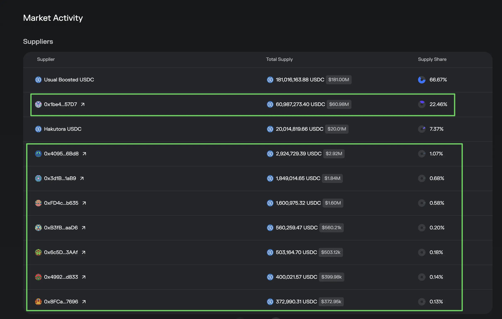

这要得益于 Morpho 无授权模式，谁都可以成为 Market 的 Supplier，你也可以。

这样做的好处是：

可以吃满 Supply 的收益，如下图，Vault 因为多池子的去放贷，1️⃣ 的收益被平均了，如果我们在 2️⃣ 中找到 APY 最高的，直塞进去，是不是就可以提高收益率。

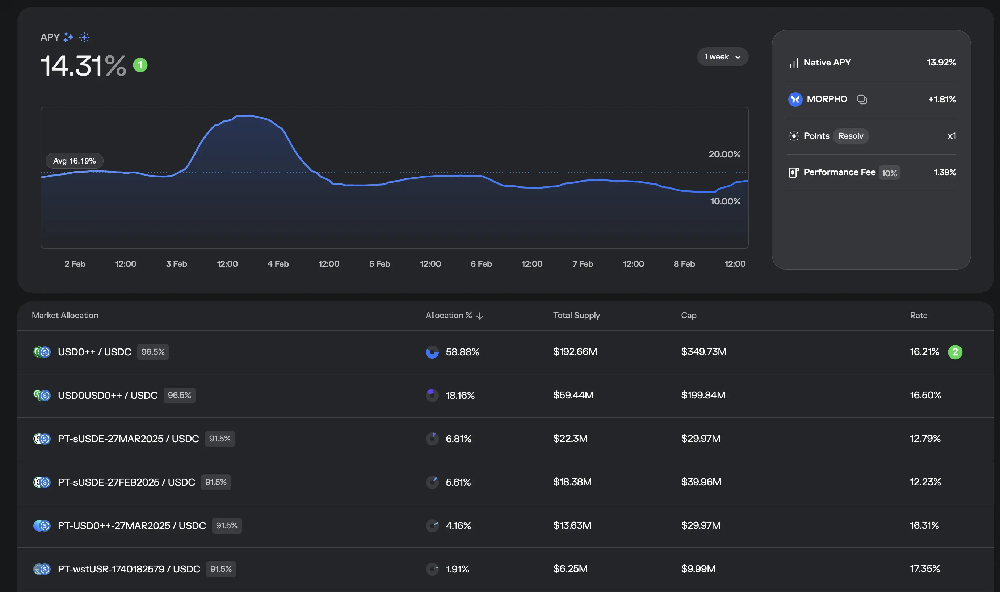

第二个好处是由于直塞绕过了 Vault，所以免收业绩费，收益可以再提升 1-2%
这样做也有坏处是：

当 Market 发生风险，Liquidity 不够的时候，你无法第一时间撤出资金
你需要自己监控抵押品的波动风险，好的基金管理员会帮你监控提前撤出（例如 OneKey Hakutora USDC），这就是业绩费的原因。当然也有收了业绩费但是并没有太多风控措施的 Valut
以下是操作，给到有需要的朋友。

WARNING
第一次操作务必使用小金额，例如 1 USDC，并使用新钱包，防止你有过什么其他操作冲突，确保 Withdraw 成功再大额操作。下列操作都是合约交互，中间任何的操作失误 / 合约信息更新 / Market 不同，都有可能导致资金永远找不回来，谨慎操作，这里不为任何结果负责，仅供学习参考，风险自担。

还是以 这个 🔗USD0++ / USDC Market 为例，其他 Martket 对应改变即可，我们要 Supply 的是 loan Token，也就是 USDC。

第一步，我们先 USDC 授权给 Morpho

先去 USDC 合约：
https://etherscan.io/token/0xa0b86991c6218b36c1d19d4a2e9eb0ce3606eb48#writeProxyContract

选择 writeProxyContract，然后 Connect to Web3

找到 Approve 函数

spender 0xbbbbbbbbbb9cc5e90e3b3af64bdaf62c37eeffcb 这个是 Morpho 合约

value 是 USDC 数量 * 1000000

点击 Write，确保钱包的模拟结果和预期一致

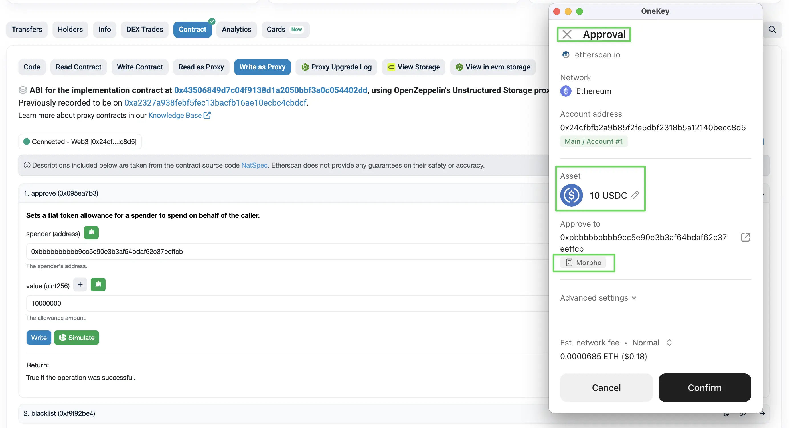

第二步，我们来到 USD0++ / USDC Market，收集好以下参数：

LoanToken: 0xA0b86991c6218b36c1d19D4a2e9Eb0cE3606eB48
CollateralToken: 0x35D8949372D46B7a3D5A56006AE77B215fc69bC0
Oracle Address: 0xBf877B424bE6d06cA4755aF2c677120eC71cac53
Interest Rate Model (irm): 0x870aC11D48B15DB9a138Cf899d20F13F79Ba00BC
LLTV: 965000000000000000
code
第三步 来到 Morpho 合约

https://etherscan.io/address/0xbbbbbbbbbb9cc5e90e3b3af64bdaf62c37eeffcb#writeContract

选择 Contract - WriteContract，然后 Connect to Web3

前面几个依次填入对应参数，下面几个

Assets 存多少 USDC，同样 USDC Amount * 1000000

shares 填 0

onBehalf 你的钱包地址

data 填 0x

点击 Write，确保钱包的模拟结果和预期一致

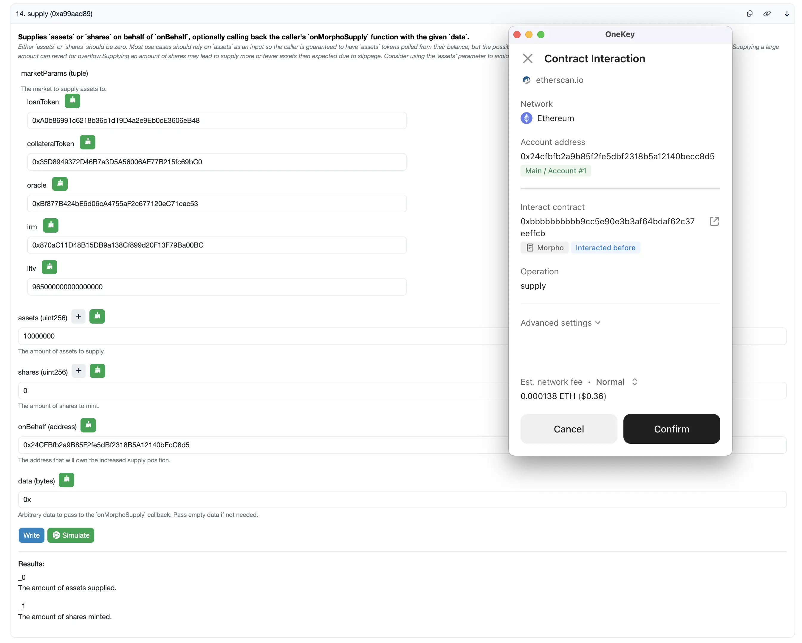

过一会你便可以在 Market 的 Supplier 中找到你的金额和地址了，这个做法有个弊端，便是你不能在网页的 Position 中看到你的资金，只能在 Makret 这个位置看到，但 $Morpho 奖励是正常给的。

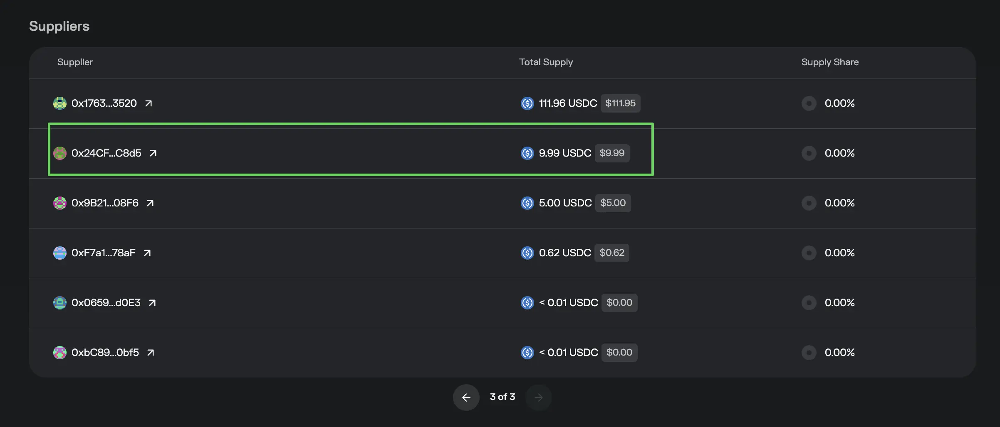

第四步，取款准备，区块浏览器上打开刚才存款的交易，选择 log，找到 Supply 事件，下面 shares 参数表示存了多少份额，提款的时候用到。

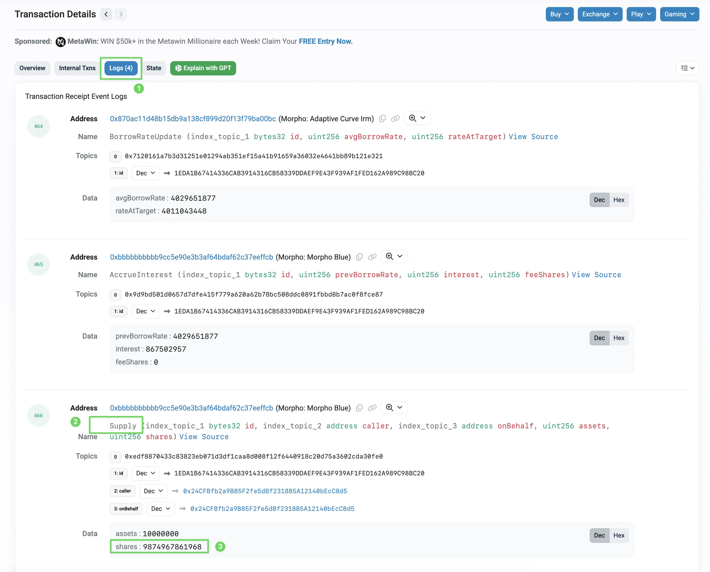

图中的参数 3

第五步，取款，来到 Morpho 合约

https://etherscan.io/address/0xbbbbbbbbbb9cc5e90e3b3af64bdaf62c37eeffcb#writeContract

选择 Contract - WriteContract，然后 Connect to Web3

前面几个依次填入对应参数，下面几个

Assets 填 0

shares 填第四步中找到的数字

onBehalf /你存钱的地址

receiver 你收钱的地址

data 填 0x

点击 Write，确保钱包的模拟结果和预期一致

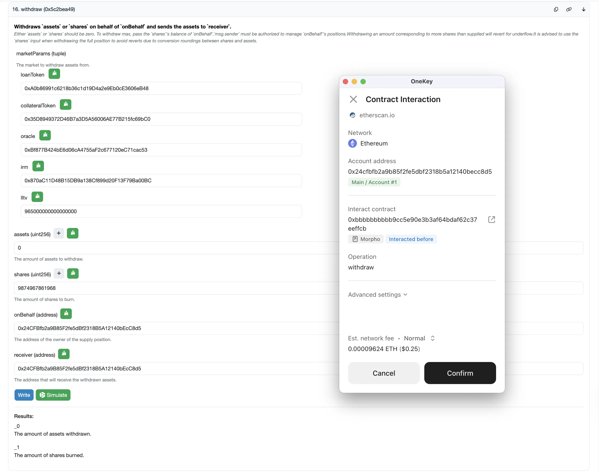

那如果没出意外，存款和取款都完成了。

总结
那以上，就是鄙人对 Morpho 的全部解析，如果有帮到你，很开心，有错误的地方，欢迎评论 / 回信。

也欢迎订阅，转发给有需要的朋友，帮助更多朋友在做简单的操作时，了解背后的原理。